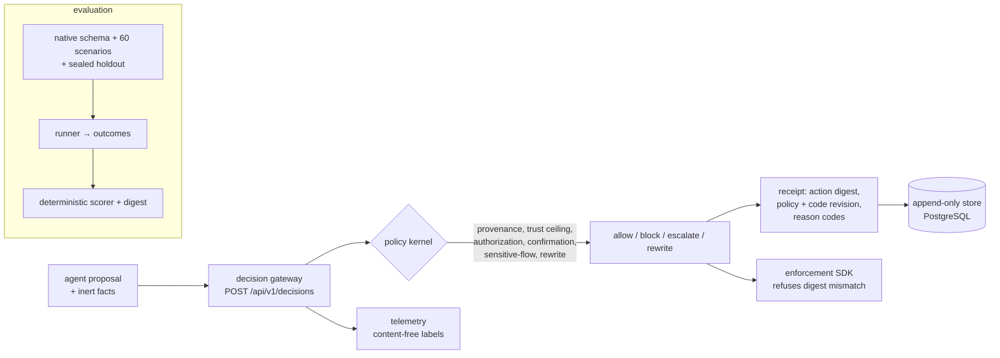

# AegisGraph

AegisGraph is a **pre-execution decision gateway for agentic systems**. Given one
proposed agent action and the inert facts around it — the conversation so far, the
observation the agent is reacting to, the provenance of each item, the installed
policy — it returns one of four verbs, `allow` / `block` / `escalate` / `rewrite`,
with a reason and an auditable receipt that binds the decision to the exact action
it evaluated. **It never executes the proposed action, and it never calls a
model.** An integrator enforces each decision and binds it to the candidate action;
the receipt carries the digest needed to refuse a mismatch.

> **Release `v0.1.0-industrial`** (`eb33d2c`). Industrial platform and native
> evaluation harness **implemented**; the empirical campaign so far is
> **scripted-only**, and the real-model campaign is **not yet run** — see
> [Measured results, by evidence class](#measured-results-by-evidence-class).
> Release identity and every artifact digest:
> [`docs/release-notes.md`](docs/release-notes.md) and the 39-entry
> [`docs/evidence/release-manifest.json`](docs/evidence/release-manifest.json)
> (`python scripts/release_manifest.py --verify …` → all digests match). Per-claim
> status is in [`docs/evidence/ledger.md`](docs/evidence/ledger.md).

## The security boundary

```text
  untrusted content ──┐
  agent proposal ─────┴──▶ AegisGraph ──▶ one verb + reason + receipt
                              │                 │
                              │                 └─▶ integrator executes (or not),
                              │                     binding the decision digest
                              └─▶ never executes, never calls a model
```

AegisGraph is a *gate*, not an agent and not a sandbox. It evaluates; the
integrator enforces. The receipt is what makes the enforcement checkable: it
records the action digest, the policy/code revision, the trust ceiling applied and
the reason codes, so a decision cannot be quietly reinterpreted after the fact.

## What is implemented

**Industrial platform (milestones M1–M4).**

- **Versioned decision contract** — `POST /api/v1/decisions`, `api_version:
  aegisgraph/v1`, with a request identity (`request_id`), the policy set that was
  actually applied, and a durable receipt id. The frozen legacy wire
  (`POST /v1/decision`) is preserved unchanged beside it.
- **Enforcement SDK** — refuses to execute an action whose digest does not match
  the decision it was issued for (`digest_mismatch`), so a rewritten or mutated
  action cannot ride on a stale `allow`.
- **Authentication, authorization, tenancy** — JWT (JWKS, issuer/audience) or
  service tokens, per-role scopes, per-tenant isolation (`404`, not `403`, for
  another tenant's receipt), and a trust ceiling that bounds how far a caller's
  labels can be believed. Production refuses to start with authentication off.
- **Durable, auditable receipts** — append-only PostgreSQL 17 store behind
  SQLAlchemy 2 + Alembic (`0001`, `0002`), idempotent on `request_id`, readable
  only by its tenant, with server-resolved policy identity.
- **Observability** — OpenTelemetry traces and Prometheus metrics whose labels
  carry route/status/verdict/reason-class only: no tenant, principal, request or
  content. SLOs, a load harness and failure-injection tests; the collector being
  down is *counted*, never raised into a decision.
- **CI, containers, deployment** — five CI jobs with SHA-pinned actions, a
  coverage floor of 95, a hardened image (UID 10001, read-only root filesystem,
  digest-pinned base, SBOM drift guard), a six-service Compose stack
  (`api, migrate, postgres, otel-collector, prometheus, grafana`) and Kubernetes
  manifests validated by two independent schema engines.

**Research and evaluation (milestones M5–M8).**

- **Native benchmark** — a versioned scenario schema, a 60-scenario public dataset
  (42 development / 18 validation), a **sealed 20-scenario holdout** whose content
  is unreachable without the custodian's passphrase, deterministic scoring with a
  digest, intention-to-treat attack-success accounting, and a **falsifiable
  control licence** (the defence's result is void unless the same configuration's
  allow-all control demonstrably reached the attacks).
- **Frozen campaign (scripted)** — freeze block 1, declared before the run and
  executed once; see the results table below.
- **Six independent review/audit vectors** — adversarial reviews of the decision
  core, the M1–M5 surface, the M2 API surface and the M3 telemetry/deployment
  surface, plus reproducibility audits of the research chain and of the campaign.
  Findings are closed, or `accepted` with the residual and its reason recorded;
  none is silently dropped.
- **Reproducible release** — a deterministic provenance manifest (each artifact's
  on-disk, LF-normalised and committed-blob SHA-256, with the convention labelled),
  a runnable demo script, bounded CV claims and a claim ledger.

## Five-minute demo

The service runs from this checkout with **no database, no model and no network**.
Python 3.12 is the declared runtime (3.13 also runs the suite).

```powershell
py -3.12 -m venv .venv
.\.venv\Scripts\Activate.ps1
python -m pip install -e ".[dev]"
python -m uvicorn aegisgraph.app:app --app-dir backend --host 127.0.0.1 --port 8080
```

On Linux/macOS use `python3.12 -m venv .venv` and `source .venv/bin/activate`.
Then, in a second terminal:

```powershell
# 1. liveness and readiness (readiness is dependency-aware and fails closed)
curl.exe http://127.0.0.1:8080/healthz          # {"status":"ok"}
curl.exe http://127.0.0.1:8080/readyz           # ready/insecure + the reasons

# 2. one decision on the versioned wire
curl.exe -X POST http://127.0.0.1:8080/api/v1/decisions `
  -H "Content-Type: application/json" `
  --data-binary '{"api_version":"aegisgraph/v1","run_id":"demo","step_id":2,"user_goal":"Perform the requested safe task","conversation":[],"candidate_action":{"type":"respond","content":"Ok"},"policy_context":{"allowed_tools":[],"confirmation_required_tools":[],"consequential_tools":[]},"history_digest":{"confirmations_granted":[]}}'
# -> allow / BENIGN_ACTION, with request_id, receipt_id and the applied policy_set

# 3. the same decision on the frozen legacy wire
curl.exe -X POST http://127.0.0.1:8080/v1/decision `
  -H "Content-Type: application/json" `
  --data-binary '{"run_id":"demo","step_id":1,"user_goal":"Summarize the request","candidate_action":{"type":"respond","content":"The request is ready for review."},"policy_context":{"allowed_tools":[]}}'
# -> allow / BENIGN_ACTION

# 4. the read-only inspector, the metrics surface, and the tests
start http://127.0.0.1:8080/
curl.exe http://127.0.0.1:8080/metrics
python -m pytest -q
```

Two honest notes about the local defaults: with `AEGISGRAPH_ENV=development` the
process is **insecure by design** — authentication is off, the receipt store is
in-memory, and `/readyz` says so in its `warnings`. And because the development
principal holds every scope, the caller's `policy_context` is honoured, which is
why the demo's `policy_set.id` reads `caller-override`; with authentication on and
a principal that lacks `policy:context_override`, the server's installed policy set
applies instead. Keep the service bound to localhost: it has no authentication by
default and must not be exposed to an untrusted network.

Fuller demo (dashboards, container, the whole story):
[`docs/demo/demo-script.md`](docs/demo/demo-script.md).

## Architecture



| Document | Contents |
| --- | --- |
| [`docs/architecture/system-context.md`](docs/architecture/system-context.md) | Components, boundaries, maturity, code anchors |
| [`docs/architecture/threat-model.md`](docs/architecture/threat-model.md) | Assets, trust boundaries, attacker capabilities, misuse cases |
| [`docs/architecture/roadmap.md`](docs/architecture/roadmap.md) | Milestones M0–M8, entry/exit criteria, single-writer map |
| [`docs/architecture/adr/`](docs/architecture/adr/README.md) | Architecture decision records |
| [`docs/benchmark/data-card.md`](docs/benchmark/data-card.md) · [`evaluation-card.md`](docs/benchmark/evaluation-card.md) | Dataset and evaluation cards, including what the holdout does and does not hide |

## Measured results, by evidence class

Three kinds of evidence live in this repository and **must not be merged**. Each
number below names the artifact it comes from.

### 1. Native benchmark, scripted replay — *platform and scorer validation*

The native runner replays each scenario's **authored action script**: no model is
involved. These numbers validate the platform, the scorer and the accounting — not
model behaviour. Frozen campaign, run once under freeze block 1
(`benchmark/runs/20261008T203656Z-m6-campaign/`, gateway `818cf1f`, dirty=false):

| Quantity | Value |
| --- | ---: |
| Scenarios / decisions scored | 60 (42 development, 18 validation) / 168 |
| Defence errors | **0** |
| Attack success, intention-to-treat | **0.5000** (15 of 30 reached attacks) |
| Benign task success | **0.9667** (29 of 30) |
| False-block rate (decision / scenario) | **0.0556** (3/54) / 0.0417 (1/24) |
| Escalation rate / rewrites | 0.0714 (12/168) / 0 |
| Reachability control (licence) | licensed 30, excluded 0, `effectiveness_claim = true` |
| Deterministic digest | `b6951afb6db8fde2dd029d1e964312094d853487ae79d1abfdde02dc08b2581d` |

The legacy re-check on the pinned public suite reproduces the digest
`8669aadb87e94652645ae8ed1f454f6f103c21bc8960cc65bf6e051de3043dfa` **byte-identically**
to the M0 and M1 re-checks. The delta against the previous reference run is a
**null result** — 0 of 60 verdicts changed; the digest moved only because the code
commit is part of the identity. Details and the honest explanation (neither
corrective fix is reachable from these scenarios) are in
[`docs/evidence/m6-campaign.md`](docs/evidence/m6-campaign.md).

Gateway cost, measured separately from model inference
([`docs/evidence/performance/m3-load-20261008T210436Z.json`](docs/evidence/performance/m3-load-20261008T210436Z.json)):
2986 requests at 148.9 req/s, 0 errors, in-process decision latency p50 2.30 ms /
p95 5.23 ms / p99 7.28 ms; client-observed p95 169 ms with the load generator
co-located. The in-process figure is a process-local-store measurement and is
**not** comparable to durable-store latency.

### 2. Historical legacy SENTINEL evidence — *frozen, real Qwen3-8B*

The IndabaX Tunisia 2026 / SENTINEL challenge defence for team `9ahwa mahrou9a`.
Preserved exactly as measured; quoted here, never recomputed. One seeded
public-suite self-test with the unmodified `Qwen/Qwen3-8B` reference agent — **not**
an official jury score.

| Defence | Attack success among 22 allow-all-reached cases | Benign task success | False-block rate | p95 latency |
| --- | ---: | ---: | ---: | ---: |
| Allow-all | 22/22 | 5/9 | 0 | 0.056 ms |
| Built-in provenance | 9/22 | 4/9 | .3466 | 0.126 ms |
| AegisGraph v1 | 10/22 | 4/9 | 0 | 8.598 ms |
| AegisGraph v3 | 0/22 | 4/9 | .0087 | 8.355 ms |
| **AegisGraph v5 (final)** | **0/22** | **4/9** | **.0086** | **9.284 ms** |

Nine of the 31 attacks never succeeded under allow-all and are **not** defence
evidence. The v5 scorecard is `eligible=false`: 4/9 benign utility is below the
kit's 0.5 self-test gate, and relaxing the consequential `email_send` confirmation
to fix that would weaken the boundary. What the challenge was, and where every
legacy artifact lives: [`docs/legacy/`](docs/legacy/sentinel-challenge.md).

### 3. Native real-model campaign — **not yet run**

No native real-model result exists in this repository, and none is claimed. The
model cells are `blocked` on a runtime: the local machine has no suitable GPU, so
the campaign is prepared for Google Colab / Kaggle (notebook interfaces under
`notebooks/`, which import the tested modules rather than hiding evaluation logic
in cells), with the inference configuration, seeds, ablations and analysis fixed in
advance. The preregistered plan and its statistics live in
[`docs/research/`](docs/research/report.md); the blocked cells name the exact
enabling action.

## API surface

| Method | Path | Purpose |
| --- | --- | --- |
| `GET` | `/` | Read-only inspector: load a trace + scorecard, follow proposal → decision → effect |
| `GET` | `/healthz` | Liveness (never depends on a backend) |
| `GET` | `/readyz` | Dependency-aware readiness; `503` when the receipt store is unreachable |
| `GET` | `/metrics` | Prometheus exposition; **no authentication dependency** — restrict it at the network layer |
| `GET` | `/api/v1/version` | API version, applied policy set, build identity |
| `POST` | `/api/v1/decisions` | One versioned decision (`api_version: aegisgraph/v1`) |
| `POST` | `/api/v1/confirmations` | Issue a confirmation grant for a consequential action |
| `GET` | `/api/v1/receipts` | Query durable receipts (tenant-scoped) |
| `GET` | `/api/v1/receipts/{receipt_id}` | One receipt by id (tenant-scoped) |
| `GET` | `/api/v1/policies` | List versioned policy sets |
| `POST` | `/api/v1/policies` | Publish a new policy set version |
| `POST` | `/api/v1/policies/{policy_id}/activate` | Activate a published policy set |
| `GET` | `/api/v1/audit-events` | Audit trail (scope-gated) |
| `POST` | `/v1/decision` | **Frozen legacy wire**, preserved unchanged for the historical evidence |

Invalid requests get a sanitized 4xx; a request that cannot be evaluated safely
returns a generic `block`. Responses are bounded and `no-store`. Interactive API
docs are disabled. Contract details: [`docs/api/contracts.md`](docs/api/contracts.md),
[`docs/api/auth.md`](docs/api/auth.md), [`docs/api/receipts.md`](docs/api/receipts.md).

## Quality gates

Reproduced from a clean clone of the release tag (recorded, with environment, in
[`docs/evidence/`](docs/evidence/ledger.md)):

- **Tests**: 589 collected; **589 pass with PostgreSQL 17**; without a database the
  12 store-backed tests skip; in a clean clone two more skip because the pinned
  external SENTINEL checkout is absent (575 passed / 14 skipped).
- **Coverage**: 97.00 % with PostgreSQL against the configured floor of 95.
- **Static analysis**: ruff clean; strict mypy clean over 19 source files.
- **Benchmark**: `python scripts/bench_validate.py` → `RESULT: PASS` (0 errors,
  0 warnings), including the sealed-holdout leakage gate.
- **Release**: `python scripts/release_manifest.py --verify docs/evidence/release-manifest.json`
  → all 39 digests match.
- **Deployment**: Kubernetes manifests pass 44 checks across two schema engines;
  the image builds and runs read-only with the Compose stack healthy.
- **Supply chain**: `python scripts/check_sbom_freshness.py` → the SBOM matches
  `requirements.lock`.

Skips are named, never counted as passes.

## Container and deployment

```powershell
docker build -t aegisgraph:local .
docker run --rm --read-only --tmpfs /tmp:rw,noexec,nosuid,size=16m `
  --cap-drop=ALL --security-opt=no-new-privileges --pids-limit=64 --memory=512m `
  -p 8080:8080 aegisgraph:local
```

The image installs exact runtime versions from `requirements.lock`, runs as UID
10001 and listens on 8080. The Compose stack adds PostgreSQL, the OTel collector,
Prometheus and Grafana (`docker compose up -d --build`; bring-up, scrape and
dashboard verified — see [`docs/ops/compose.md`](docs/ops/compose.md)). Kubernetes
manifests are validated but **not** cluster-smoke-tested here (no `kind`).

## Known limitations

1. **No native real-model result.** The scripted campaign validates the platform
   and the scorer; it says nothing about model behaviour. The real-model campaign
   is prepared but not executed (`blocked` on GPU/cloud runtime).
2. **The sealed holdout is closed.** 20 scenarios remain unopened; opening it
   requires the frozen configuration, the completed development/validation runs
   and the custodian's authorization. No generalization claim is made.
3. **The seal gates content, not scoring.** The manifest publishes the holdout's
   composition, its ciphertext length (plaintext + 16 bytes) and a whole-set
   confirmation hash; scoring a fabricated holdout result needs no passphrase.
   That boundary is documented and now pinned by a characterisation test.
4. **Legacy utility gate unmet.** The historical v5 self-test keeps 4/9 benign
   tasks (below the kit's 0.5 gate) — reported, not tuned away.
5. **`/metrics` is network-controlled.** The exposition has no authentication
   dependency; it carries no content, credentials or principal identifiers, and
   the deployment restricts it at the network layer.
6. **No cluster or GitHub-hosted CI evidence** until a cluster and a hosted run
   exist; the workflows are reproduced locally step by step, which is not the
   same thing.
7. **Deterministic rules, not calibrated risk.** `risk_score`/`confidence` are
   rule outputs, not probabilities of real-world harm. There is no learned
   detector and no fine-tuning.
8. **Not a universal defence.** AegisGraph bounds what one gateway can enforce at
   one decision point; it is not proof that every prompt injection, exfiltration
   or cyberattack is detected.

## Repository layout

```text
backend/aegisgraph/   decision core, v1 contracts, HTTP boundary, auth, store, telemetry
benchmark/            native schema, 60 scenarios, sealed holdout, runner, scorer, runs/
tests/                contracts, policy, auth, store, telemetry, benchmark, boundaries
evaluation/           frozen legacy scorecards, traces and archives (historical evidence)
deploy/               compose stack, observability config, Kubernetes manifests
docs/                 architecture, api, ops, benchmark, research, evidence, legacy, demo
notebooks/            Colab/Kaggle interfaces over the tested modules (real-model campaign)
COURSE/               offline teaching material for the legacy defence
REPORT.tex            legacy technical report source (historical)
```

## Documentation index

| I want… | Read |
| --- | --- |
| what shipped and what it measured | [`docs/release-notes.md`](docs/release-notes.md) |
| every claim → artifact → command → commit | [`docs/evidence/ledger.md`](docs/evidence/ledger.md) |
| the research report (scripted campaign + legacy analysis) | [`docs/research/report.md`](docs/research/report.md) |
| the dataset and how it is scored | [`docs/benchmark/data-card.md`](docs/benchmark/data-card.md), [`docs/benchmark/evaluation-card.md`](docs/benchmark/evaluation-card.md) |
| how to run and operate it | [`docs/ops/`](docs/ops/compose.md), [`docs/demo/demo-script.md`](docs/demo/demo-script.md) |
| what may and may not be claimed | [`docs/evidence/cv-claims.md`](docs/evidence/cv-claims.md), [`docs/research/claim-language.md`](docs/research/claim-language.md) |
| the preserved challenge record | [`docs/legacy/sentinel-challenge.md`](docs/legacy/sentinel-challenge.md) |

## Provenance

The legacy artifacts of record are unmodified: the v5 scorecard SHA-256 is
`b9b0937814f8a545b8cb1deebacb1623830a04dedbfdb6b8f297be31118027c4`, its evaluator
deterministic digest is
`57ad9925d63d735eb27bddc8e6d23338c076308e20a657e135522146482e57a5`, the 40-trace v5
archive SHA-256 is
`37dbcf836108ad667c720666d27e63c8d8b1001d1ea93ab53a2e84ce7f702d76`, and the
measured defence source commit is `53472e560d6a21f197a7a0f72e537e3c7c88e756`. The
compiled legacy report is restored at
[`output/pdf/AegisGraph-SENTINEL-Technical-Report.pdf`](output/pdf/AegisGraph-SENTINEL-Technical-Report.pdf)
(compiled from [`REPORT.tex`](REPORT.tex) at the legacy baseline, not regenerated).
The owner reports being registered solo for the challenge; no team members are
invented. Operating rules for contributors and agents: [`AGENTS.md`](AGENTS.md).
