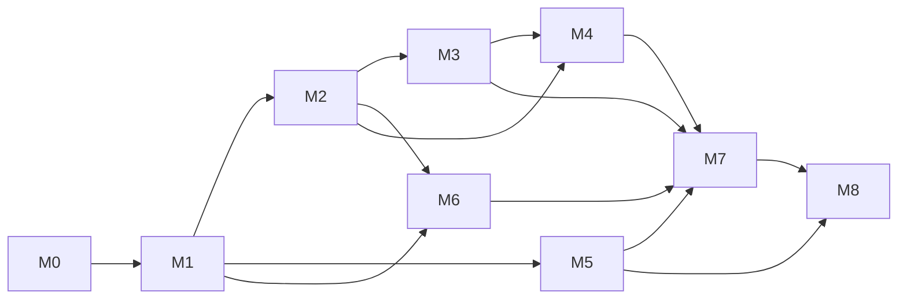

# Roadmap — milestones M0–M8

**Provenance of this plan.** M0 is defined by the orchestrator's baseline report
(`docs/evidence/m0-baseline-report.md`, orchestrator-owned). **M1–M8 below are
`proposed` by the product/architecture charter and require orchestrator
confirmation before dispatch.** Dates are deliberately omitted: each milestone
gates on its exit criteria, not on a calendar.

Status vocabulary: `implemented` / `partial` / `proposed`. Blocked cells name the
missing tool and the command that would unblock them.

## 1. Milestone overview

| Milestone | Outcome | Depends on | Primary ADR |
| --- | --- | --- | --- |
| **M0** | Intake, baseline reproduced, charter, architecture, threat model, ADRs, ledger skeleton | — | all |
| **M1** | Native versioned contracts, policy versioning, legacy adapter isolated | M0 | — |
| **M2** | Durable receipt/audit store (PostgreSQL + SQLAlchemy 2 + Alembic) | M1 | ADR-0001 |
| **M3** | Authentication + tenancy (OIDC/JWT and scoped service tokens) | M1, M2 | ADR-0002 |
| **M4** | Telemetry + observability (OpenTelemetry, Prometheus, Grafana) | M2, M3 | ADR-0003 |
| **M5** | Evaluation framework (native schema authoritative + legacy adapter + optional Inspect AI) | M1 | ADR-0004 |
| **M6** | Enforcement + integration SDK binding decisions to exact actions | M1, M2 | — |
| **M7** | Deployment and operations (Docker/Compose first, Kubernetes validated) | M2–M6 | ADR-0005 |
| **M8** | Release and GA hardening (versioned release, provenance manifest, security review) | M1–M7 | all |

## 2. Dependency graph

Hard ordering rules:

1. **Contracts (M1) precede everything.** Every later milestone imports the
   versioned request/response/receipt models. Changing them after M2 forces a
   migration and invalidates stored receipts.
2. **Persistence (M2) precedes auth and telemetry.** Auth decisions and telemetry
   exports both persist; they must target a stable schema.
3. **Enforcement (M6) is the only path to "bound action executes".** Until M6,
   the platform is decision-only and the integrator carries the risk.
4. **Deployment (M7) is last among build milestones** because it packages the
   schema, auth, telemetry and SDK together.
5. **M5 (evaluation) can run in parallel with M2–M4** — it depends only on M1 —
   but its native results are not a release gate until M8.

## 3. Milestone detail

### M0 — Charter and architecture baseline *(this milestone)*

- **Entry:** legacy baseline `649f65a` reproduced in the integration worktree.
- **Exit:** `AGENTS.md`, `PRODUCT.md`, `README.md`, system context, threat model,
  six ADRs, roadmap, legacy record + evidence map, and the ledger skeleton merged;
  `python -m pytest -q` green.
- **Blocked:** nothing.

### M1 — Native contracts, policy versioning, legacy adapter boundary

- **Entry:** M0 merged. Baseline suite green.
- **Work:** extract a versioned native decision/receipt schema; introduce an
  explicit policy identifier + version carried in every decision; isolate the
  legacy SENTINEL wire contract behind a `legacy/` adapter so both can evolve
  without drift; add a `GET /v1/policies` read model (proposed in the README API
  table).
- **Exit:** contract tests for both surfaces; no scenario/tenant id anywhere in a
  decision path; legacy wire contract byte-compatible.
- **Risk:** touching shared contracts is high blast radius — single writer only.

### M2 — Persistence and audit store (ADR-0001)

- **Entry:** M1 frozen contracts.
- **Work:** PostgreSQL + SQLAlchemy 2 + Alembic; append-only `receipts` table
  keyed by request id and action digest; `POST /v1/receipts` write/query.
- **Exit:** migration from empty DB applies cleanly; a receipt round-trips and a
  mutated receipt is rejected; tests run against containerized PostgreSQL.
- **Blocked locally:** no host `psql`. Intended path is containerized PostgreSQL
  via Docker. Command to verify once available:
  `docker run --rm -e POSTGRES_PASSWORD=... -p 5432:5432 postgres:16`.
  Until then the store is exercised through the container only; do not substitute
  SQLite and call it verified.

### M3 — Authentication and tenancy (ADR-0002)

- **Entry:** M2 receipt schema; M1 principal-aware contracts.
- **Work:** OIDC/JWT for interactive principals plus scoped service tokens for
  machine callers; per-tenant authorization on every read/write; trust and
  sensitivity labels assigned from the authenticated principal, never the
  payload.
- **Exit:** unauthenticated access rejected; cross-tenant reads denied; token
  scopes enforced; negative tests for forged labels and replay.
- **Blocked:** no external IdP available; use a local test issuer (e.g. a
  containerized OIDC test provider) and label it as a test issuer, never as
  production verification.

### M4 — Telemetry and observability (ADR-0003)

- **Entry:** M2 store, M3 principals.
- **Work:** OpenTelemetry traces across boundary → adapter → kernel → store;
  Prometheus counters/histograms (decisions by verdict/reason, latency, failures,
  enforcement outcomes); Grafana dashboards; SLOs for decision latency and
  fail-closed rate.
- **Exit:** a decision emits a trace and increments metrics; dashboards render
  real data; no content or secrets in telemetry attributes.
- **Blocked:** none locally — the Prometheus/Grafana stack runs in Compose.

### M5 — Evaluation framework (ADR-0004)

- **Entry:** M1 contracts.
- **Work:** a native evaluation schema that is authoritative for platform claims;
  the legacy SENTINEL suite preserved behind a versioned adapter; optional
  Inspect AI integration for external benchmarks (e.g. AgentDojo); the allow-all
  reachability control generalized into the native harness.
- **Exit:** a native run produces a scorecard with deterministic digest; the
  legacy adapter reproduces the preserved baseline without editing the legacy
  artifacts; reachability gate is mandatory in CI.
- **Blocked:** real-model reruns need `ollama` or an authorised API — neither is
  available. Synthetic runs are labelled and cannot substitute.

### M6 — Enforcement and integration SDK

- **Entry:** M1 (receipt/digests), M2 (store).
- **Work:** an enforcement adapter that accepts only an action whose digest
  matches the receipt; an SDK that wraps the agent loop; explicit handling of
  `escalate` (resume with a bound confirmation) and `rewrite` (re-validate, then
  execute the replacement).
- **Exit:** an action with a mismatched digest is refused; an escalated action
  executes only after a matching confirmation; the decision is stored before the
  action is allowed to execute.

### M7 — Deployment and operations (ADR-0005)

- **Entry:** M2–M6 complete.
- **Work:** harden the Compose stack (service + PostgreSQL + Prometheus +
  Grafana); Kubernetes manifests validated by schema tooling; document the
  operator runbook and backup/restore for the receipt store.
- **Exit:** Compose stack starts from a clean machine and passes a smoke test;
  Kubernetes manifests validate (`kubectl apply --dry-run=server` or equivalent).
- **Blocked:** Kubernetes **cluster smoke test** needs `kind` (not installed).
  Manifest validation is possible without it; a running-cluster test is `blocked`
  and must be reported as such. Command when available:
  `kind create cluster --name aegisgraph && kubectl apply -k deploy/k8s`.

### M8 — Release and GA hardening

- **Entry:** M1–M7 exit criteria met.
- **Work:** versioned release with a provenance manifest (paths + SHA-256);
  security review of the new surfaces; dependency audit; migrate the legacy
  evidence links; complete the ledger (every claim `verified` or explicitly
  `blocked`).
- **Exit:** every headline claim in `docs/evidence/ledger.md` is `verified` with
  an artifact, digest and command, or explicitly `blocked` with the missing tool.
- **Blocked:** any claim needing model inference or a Kubernetes cluster.

## 4. Blocked-by-tooling ledger

| Capability | Status | Missing tool | Unblock command / condition |
| --- | --- | --- | --- |
| Kubernetes cluster smoke test | blocked | `kind` | `kind create cluster --name aegisgraph` |
| PostgreSQL on the host | blocked | `psql` | containerized PostgreSQL (Docker) is the intended path |
| Real-model evaluation reruns | blocked | `ollama` | install `ollama` + `qwen3:8b`, or authorize an API |
| Paid-model benchmarking | blocked | API credentials | explicit owner authorization |
| Docker-engine live run | available | — | `docker build` + `docker run` (Docker 29.6.2 present) |

## 5. Single-writer map (M1–M8)

One writer per path. Multiple agents may work in parallel only on disjoint files.
The orchestrator arbitrates conflicts and owns the shared files.

### Orchestrator-owned (nobody else edits)

| Path | Reason |
| --- | --- |
| `pyproject.toml`, `requirements.lock` | Dependency and interpreter contract |
| `benchmark.lock` | Pinned legacy benchmark identity |
| `Dockerfile`, `.dockerignore` | Build contract |
| `.github/**` | CI and gates |
| `backend/aegisgraph/contracts.py` | Shared canonical contract (highest blast radius) |
| `docs/evidence/m0-baseline-report.md` | Orchestrator baseline record |
| `AGENTS.md`, `PRODUCT.md`, `README.md` | Shared operating/product docs |
| `docs/architecture/**` | Charter (this agent, M0 only) |

### Per-milestone ownership (proposed)

| Milestone | Writer role | Owned paths |
| --- | --- | --- |
| M1 | Contracts/API implementer | `backend/aegisgraph/sentinel.py`, new `backend/aegisgraph/legacy/**`, `backend/aegisgraph/policy.py` versioning, `tests/test_contracts.py` |
| M2 | Persistence engineer | new `backend/aegisgraph/store/**`, `migrations/**`, `tests/test_store.py` |
| M3 | Platform/security engineer | new `backend/aegisgraph/auth/**`, `tests/test_auth.py` |
| M4 | Platform/telemetry engineer | new `backend/aegisgraph/telemetry/**`, `deploy/observability/**`, `tests/test_telemetry.py` |
| M5 | Evaluation engineer | `evaluation/**` (add-only; never edit legacy artifacts), new `evaluation/native/**`, `scripts/**` |
| M6 | Contracts/API + integration | new `backend/aegisgraph/enforce/**`, new `sdk/**`, `tests/test_enforcement.py` |
| M7 | Platform engineer | new `deploy/**`, `docs/runbooks/**` |
| M8 | Orchestrator + documentation writer | release manifest, `docs/evidence/ledger.md`, release notes |

### Never shared mid-flight

- The legacy evidence under `evaluation/real-qwen/**` is **add-only**. New
  artifacts get new names; existing digests are never recomputed or edited.
- `backend/aegisgraph/engine.py` is a single-writer file: policy changes are one
  writer at a time, with a component ablation and a matched evaluation rerun.
- Any change to a shared contract (`contracts.py`, `sentinel.py`) must land
  before dependent milestone work begins, not in parallel with it.

## 6. Gate for every milestone

Each milestone exit runs, in the integration worktree: `python -m pytest -q`,
`python -m ruff check backend tests`, `python -m mypy`, plus the milestone's own
smoke run. The orchestrator independently verifies each "complete" claim and
updates `docs/evidence/ledger.md` before the milestone is closed.
