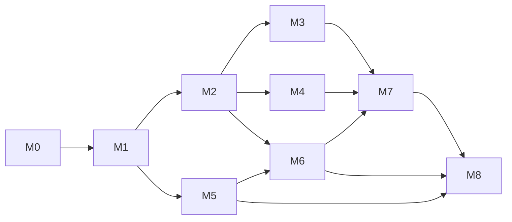

# Roadmap — program milestones M0–M8

The program's milestone list is **authoritative**; this roadmap maps the platform
work onto it. M0 is defined by the orchestrator's baseline report
(`docs/evidence/m0-baseline-report.md`, orchestrator-owned). The milestone
definitions below were confirmed by the orchestrator on 2026-10-08 (an earlier
draft numbering is superseded).

Status vocabulary: `implemented` / `partial` / `proposed`. Blocked cells name the
missing tool and the command that would unblock them. Dates are deliberately
omitted: each milestone gates on its exit criteria, not on a calendar.

## 1. Milestone overview

| Milestone | Program scope | Outcome | Depends on | Primary ADR | Status (2026-10-08) |
| --- | --- | --- | --- | --- | --- |
| **M0** | Charter + baseline | Intake, baseline reproduced, charter, architecture, threat model, ADRs, legacy record, ledger skeleton | — | all | `implemented` (closed) |
| **M1** | Contracts + enforcement | Native versioned contracts with a policy/code revision in every decision; legacy adapter isolated; enforcement binding and integration SDK | M0 | ADR-0006 | `implemented` — contract, enforcement SDK, bounded input and strict confirmation landed (`4013b59`, `7502df3`); legacy suite re-checked decision-identical |
| **M2** | Auth + policy + audit store | Authentication and tenancy; versioned policy; durable append-only receipt/audit store | M1 | ADR-0001, ADR-0002 | `implemented` + **verified live by the orchestrator** (`7a87e8b`, merged at `4350af3`, corrective round `940ed13`): F1, F2 and F3's caller-authority half fixed (residual F3 accepted); with PostgreSQL 17 the suite is **569 passed / 2 skipped = 96.81 %** in a clean clone after the M3/SBOM rounds (497 passed / 96.85 % at `36a279a`), and **557 passed / 14 skipped = 93.76 %** without a database; the CI `quality` job now runs a PostgreSQL service and the floor is raised to **95** (`bf02ddc`), so a silent skip of the database tests cannot pass |
| **M3** | Observability + reliability | OpenTelemetry, Prometheus, Grafana, SLOs, fail-closed guarantees under load | M1, M2 | ADR-0003 | `implemented` — telemetry, metrics, SLOs, the load harness and failure-injection tests landed (`3d0d748`, merged at `7147eb3`) and verified live by the orchestrator: 8 `aegisgraph_*` metric families with no tenant/principal/request/content label, an exporter outage counted rather than raised, and a load report with the corrected re-measured baseline (2986 requests, warm-up excluded, 148.938 req/s, in-process p95 5.227 ms, 0 errors; `m3-load-20261008T210436Z.json`, targets in `docs/ops/slo.md`). The shipped stack now scrapes the API and serves the dashboard (verified end to end, `docs/ops/compose.md`; ledger P7) — the only caveat is that it ships no credentials, so `aegisgraph_decisions_total` stays empty until a caller presents a token |
| **M4** | CI/CD + containers + deployment | Pipelines and gates; hardened Compose stack; Kubernetes manifests validated and smoke-tested | M1, M2 | ADR-0005 | `implemented` with two named gaps: **no cluster smoke test** (`kind` absent) and **F9** — the suite must run *inside* the built image (CI runs it with a PostgreSQL service, but not in the image). The hosted workflow is **verified running**: the release tag `v0.1.0-industrial` (`eb33d2c`) has a green run `37846970280` (2026-10-08T21:28:01Z) and the current tip `cb3f82f` has a green run `37863688964`; the branch's history is 10 success / 1 failure (a test defect, fixed in `cc3a14f`) / 17 `cancel-in-progress` cancellations |
| **M5** | Evaluation framework + benchmark data | Native evaluation schema authoritative; versioned legacy adapter; benchmark data + reachability gate | M1 | ADR-0004 | `implemented` — schema, 60-scenario dataset, deterministic scoring, sealed holdout; **scripted adapter only**, no holdout run |
| **M6** | Empirical campaign | Real-model runs, multi-seed variance, component ablations, generalization | M2, M5 | ADR-0004 | `partial` — **freeze block 1 declared and its scripted results recorded** (`4481e26`/`f3129d0`, gateway `818cf1f`): C1 digest `b6951afb…`, 60 scenarios, 0 errors, ASR 0.5000 intention-to-treat, benign 0.9667, FBR 0.0556; C3 legacy recheck `8669aadb…`; delta vs the previous reference a **null result** on 60/60 verdicts, proven by the independent campaign audit (Agent I3), which reproduced every number (ledger P68). **Three provenance gaps recorded:** the gateway identity is runner-attested, the credential's scopes/ceiling are not in the artifact, and campaign latency is not comparable to the in-process run. The real-model cells stay **blocked** (no `ollama`, GPU or paid API) |
| **M7** | Independent review | Adversarial and security review of the new surfaces; reproducibility audit | M3, M4, M6 | all | `partial` — three adversarial reviews (M0 `L15`, M1–M5 `P25–P29`, M2 surface `P54–P62`), an independent research/reproducibility audit (`P30–P52`), an independent campaign audit (I3, `P68`) and the M3 telemetry/load review (H4, `P75–P84`) have landed — six vectors in all; what remains is the reproducibility audit of every headline claim and an independent re-run of the gates |
| **M8** | Docs + demo + release | Documentation, demo, versioned release, provenance manifest | M5, M6, M7 | all | `implemented` — the release is tagged **`v0.1.0-industrial`** at `eb33d2c`: `docs/release-notes.md`, the 39-entry `docs/evidence/release-manifest.json` (`scripts/release_manifest.py --verify` → all 39 digests match in a fresh clone at the tag), the runnable demo script and the bounded CV-claims document. **Residuals named, not done:** P9 (multi-seed real-model campaign — `blocked` on the runtime, which the exit asks for), P10 (the independent re-run of the gates, in flight against the tag) and P49 (no characterisation test pins the seal/scoring boundary) |

### M0 execution status (closed)

- **Entry:** legacy baseline `649f65a` reproduced in the integration worktree.
- **Exit:** `AGENTS.md`, `PRODUCT.md`, `README.md`, system context, threat model,
  six ADRs, roadmap, legacy record + evidence map, and the ledger skeleton merged;
  `python -m pytest -q` green.
- **Blocked:** nothing.

## 2. Dependency graph

Hard ordering rules:

1. **Contracts + enforcement (M1) precede everything.** Every later milestone
   imports the versioned request/response/receipt models, and every receipt must
   carry the policy version and code commit that produced it (see the M0
   reproduction finding in [`../evidence/ledger.md`](../evidence/ledger.md) row
   L14). Changing contracts after M2 forces a migration and invalidates stored
   receipts.
2. **Auth + policy + audit store (M2) precede observability and deployment.**
   Auth decisions, policy versions and telemetry exports all persist; they need a
   stable schema.
3. **Evaluation framework (M5) can run in parallel with M2–M4** — it depends only
   on M1 — but its native results are not a release gate until M8.
4. **The empirical campaign (M6) needs M5 (harness) and M2 (stored policy/code
   revision in every result).**
5. **Independent review (M7) follows the empirical campaign and a deployable
   stack**; it reviews evidence, not intentions.
6. **Release (M8) is last.**

## 3. Milestone detail

### M0 — Charter and baseline *(complete)*

Baseline reproduced (`187 passed`, Ruff and mypy clean), charter and architecture
written, ADRs proposed, legacy evidence mapped, ledger seeded. See the handoff
for the exact commits.

### M1 — Contracts + enforcement *(complete)*

- **Entry:** M0 merged. Baseline suite green.
- **Status:** landed (`4013b59`, `7502df3`). Evidence and measured numbers are in
  the ledger, section B (rows P1, P6, P11–P14): the generic surface carries
  version, policy set, request/receipt identity and both digests; eleven live
  requests emitted eleven decision records whose `receipt_id` matched the
  response; the enforcement SDK refused a tampered action with `digest_mismatch`;
  a 1.2 MB body returned 413 and the 880k-character adversarial request decided in
  37 ms on the local host. The legacy suite is decision-identical to the M0
  recheck (ledger L16).
- **Work:** extract a versioned native decision/receipt schema; carry an explicit
  **policy version and source code revision** in every decision, receipt,
  scorecard and artifact; isolate the legacy SENTINEL wire contract behind a
  `legacy/` adapter so both evolve without drift; build the enforcement adapter
  that refuses an action whose digest does not match the receipt, plus the
  integration SDK (escalation resume, rewrite re-validation).
- **Exit:** contract tests for both surfaces; no scenario/tenant id in a decision
  path; legacy wire contract byte-compatible; a digest-mismatched action is
  refused; an escalated action executes only after a matching confirmation.
- **Risk:** shared contracts have the highest blast radius — single writer only.
- **Security exit:** the F4–F7 regression criteria are covered by tests (see the
  findings map immediately below); F1–F3 stay open by design until M2 (M2 has
  since closed F1, F2 and F3's caller-authority half — see the M2 section below).
- **ADR:** ADR-0006.

### Security findings → milestones

The M0 adversarial review produced 10 findings, `F1`–`F10`, registered with their
severities, preconditions and per-finding regression criteria in
[`../evidence/security-findings.md`](../evidence/security-findings.md). That
register is the source of record (orchestrator-owned; read-only here); this map
only assigns each finding to the milestone that closes it.

| Finding | Severity | Subject | Closed in |
| --- | --- | --- | --- |
| F1 | high (critical if internet-reachable) | Unauthenticated decision boundary; caller supplies every security-relevant input | M2 |
| F2 | high | Confirmation self-granted inside the same envelope | M2 |
| F3 | high | Attacker-declared trust/sensitivity labels and policy facts | M2 |
| F4 | high | Algorithmic-complexity DoS in claim scanning | **M1** |
| F5 | medium | Unbounded request body | **M1** |
| F6 | medium | Non-injective canonical-digest matching; unbound, unexpiring, reusable grants | **M1** (new surface only) |
| F7 | medium | No decision identity, receipt or audit record at the wire boundary | **M1** partially (identity + emitted record); M2 owns the durable store |
| F8 | low | Dependency pins carry no hashes | M4 |
| F9 | medium (evidence fidelity) | Suite environment differs from the shipped image | M3 (CI runs the suite in the image) / M4 |
| F10 | low | Application directory writable by the runtime user | M4 |

**M1 closes F4, F5, F6 on the new surface and F7 partially** (identity plus one
emitted decision record; the append-only store is M2's). **M1 leaves open**
F1, F2 and F3, which M2 closes with authenticated, tenant-scoped policy and
server-issued grants — an unauthenticated body cap or digest binding is not an
authorization control. F8 and F10 close in M4 (hashed dependency pins, read-only
root filesystem); F9 remains open until CI runs the suite inside the built image
(M3/M4). F6's **legacy** matching rule is deliberately unchanged in M1: any change
there requires a new evaluation artifact, never an edit of the frozen scorecards
in [`../evidence/ledger.md`](../evidence/ledger.md).

**Landed.** M1's four fixes have landed and are verified in the ledger
(P11–P14): F4 and F5 by the bounded scan and the 413 body cap, F6 by strict
confirmation binding on the generic surface, F7 by the decision identity and the
emitted record (the durable store remains M2's). The register's own `open`/`fixed`
statuses are the orchestrator's to update; this roadmap records only which
milestone owns each finding.

### M2 — Auth + policy + audit store

- **Entry:** M1 frozen contracts.
- **Status:** `implemented` and **verified live by the orchestrator** (`7a87e8b`,
  merged at `4350af3`, corrective round `940ed13`). Live reproductions: anonymous
  `POST /api/v1/decisions` → `401`; an `auditor` token → `403` naming the missing
  scope; `decision_client` → `200`; another tenant's receipt → `404`; a
  `system_policy` label above the credential's ceiling → `403 TRUST_CEILING_EXCEEDED`;
  caller `policy_context` ignored without `policy:context_override`. **F1 and F2
  are fixed; F3 is fixed for its caller-authority half**, and its residual is
  `accepted`: the *harness* still supplies provenance labels, so a deployment must
  treat the caller as the source of truth for its own evidence, bounded by the
  ceiling (`docs/api/auth.md` §5–6). The corrective round closed the second
  review's policy-identity, confirmation-binding and `request_id` items
  `H2-02/H2-03/H2-05`; ledger P26–P28). With PostgreSQL 17 the suite is
  **569 passed / 2 skipped = 96.81 %** in a clean clone after the M3/SBOM rounds
  (497 passed / 96.85 % = 2676/2763 at `36a279a`); without a database
  **557 passed / 14 skipped = 93.76 %** (the `db`-marked tests skip without
  `AEGISGRAPH_TEST_DATABASE_URL`, as do the two `.sentinel_reference` ones). The
  coverage floor was **red** at `4350af3` on such a machine (93.06 % = 2521/2709,
  and `ci.yml` started no service —
  ledger P15); that is now fixed: the `quality` job starts a PostgreSQL 17
  service and the floor is **95** (`bf02ddc`), which doubles as the guard that
  the database tests actually ran (`docs/ops/ci.md`: 96.42 % (2612/2709) with
  the service, 92.80 % (2514/2709) without). **Both reviews of this surface are
  closed**: the second review's `H2-01` at `5480a77`/`36a279a` and `H2-04` at
  `5480a77` (ledger P25, P29) with `H2-02`/`H2-03`/`H2-05` at `940ed13`
  (P26–P28), and the third review's `H3-01`…`H3-09` at `2484b09`/`29fa3ba`
  (P54–P62: seven fixed, `H3-06`/`H3-08` accepted with reasons). With F1–F3, only
  **F8** (`accepted`) and **F9** (`open` — the suite must run inside the built
  image; see M4) remain from any review.
- **Work:** OIDC/JWT for interactive principals plus scoped service tokens for
  machine callers (ADR-0002); per-tenant authorization on every read and write;
  an explicit policy store with versions and an audit trail; PostgreSQL +
  SQLAlchemy 2 + Alembic with an append-only `receipts` table keyed by request id
  and action digest (ADR-0001).
- **Exit:** migration from empty DB applies cleanly; a receipt round-trips and a
  mutated receipt is rejected; unauthenticated access rejected; cross-tenant
  reads denied; policy version changes are auditable and attributable.
- **Blocked locally:** no host `psql`; the intended path is containerized
  PostgreSQL via Docker. Until then the store is exercised through the container
  only — do not substitute SQLite and call it verified.
- **ADRs:** ADR-0001, ADR-0002.

### M3 — Observability + reliability

- **Entry:** M2 store and principals.
- **Status:** `implemented` and verified live by the orchestrator (`3d0d748`,
  merged at `7147eb3`). `/metrics` exposes **8 `aegisgraph_*` families** with no
  tenant, principal, request, receipt or content label; with the OTLP endpoint
  pointed at a dead port three decisions still returned `allow` / `escalate` /
  `block` in 16–30 ms and the export-failure counter incremented with no log
  noise; the load report
  (`docs/evidence/performance/m3-load-20261008T210436Z.json`, commit `fe46e7d`)
  records **2986 measured requests with the 40 warm-up requests excluded**
  (`counts_match_measured: true`) at 148.94 req/s with **service-side p50
  2.302 ms / p95 5.227 ms / p99 7.283 ms and 0 errors** on an honestly-labelled
  local host busy with concurrent work — the SLO targets are set above that worse
  run (`docs/ops/slo.md`); the earlier report `m3-load-20261008T193951Z.json` is
  **superseded history** (its service-side block included the warm-up, H4-01, and
  its sidecar digest did not match the committed blob, H4-02), kept in the
  ledger's P4 row rather than deleted; failure injection
  covers database-down, collector-down, cancellation and overload (ledger P4).
  **Gap closed (Agent E, `4d51cde`/`75fa1b9`):** the observability provisioning is
  consolidated on one tree, **`deploy/observability/**`** (one Prometheus config
  with the `aegisgraph-api` job, Grafana provisioning + the `aegisgraph-service`
  dashboard, the OTel collector config), and `deploy/compose/**` is deleted.
  Verified end to end on the running stack (`docs/ops/compose.md`):
  `up{job="aegisgraph-api"} = 1` scraping `http://api:8080/metrics`, six non-empty
  `aegisgraph_*` metric names after traffic,
  `sum by (route,status) (aegisgraph_requests_total)` → `{/healthz,200}=2`,
  `{/api/v1/decisions,422}=6`, `{/v1/decision,200}=4`, and Grafana serving the
  provisioned dashboard (10 panels) with a healthy `prometheus` datasource
  through its own proxy. **Caveat:** the stack ships no credentials, so
  `aegisgraph_decisions_total` stays empty until a caller presents a token.
- **Work:** OpenTelemetry traces across boundary → adapter → kernel → store;
  Prometheus counters/histograms (decisions by verdict/reason, latency, failures,
  enforcement outcomes); Grafana dashboards; SLOs for decision latency and
  fail-closed rate; load and failure-injection tests proving the gateway stays
  fail-closed.
- **Exit:** a decision emits a trace and increments metrics; dashboards render
  real data (verified end to end on the shipped stack — `docs/ops/compose.md`);
  no content or secrets in telemetry attributes; the fail-closed invariant holds
  under fault injection.
- **ADR:** ADR-0003.

### M4 — CI/CD + containers + deployment *(complete, three gaps named)*

- **Entry:** M1, M2.
- **Status:** landed (`6e4f6b2`, `891483d`, `79f9e59`, `40404a0`, `3889f10`;
  CI reworked at `bf02ddc`, SBOM at `90eb2dc`/`818cf1f`). Verified here: the
  workflow defines five jobs with
  SHA-pinned actions and a coverage floor of **95** (raised from 94 at `bf02ddc`;
  measured 95.03 % = 1358/1429 at `3353886` under the old floor); the image
  builds reproducibly and runs non-root (uid 10001) with a read-only rootfs
  serving `/healthz` and a decision; `deploy/k8s` renders 7 objects and passes 7
  schema checks under two validators plus 22 policy assertions; the Compose
  configuration parses to six services (`api`, `migrate`, `postgres`,
  `otel-collector`, `prometheus`, `grafana`, with the observability provisioning
  under `deploy/observability/**`). The image was **rebuilt at the current
  lock revision** `d0bf0f55…` (39 pinned entries) as `sha256:bb373f36…`
  (73,084,467 B, context commit `57596f3`), the SBOM was regenerated to match, and
  `scripts/check_sbom_freshness.py` now fails loudly on drift, wired into CI
  before the image build — closing the drift this section previously carried
  (ledger P16, P18). **Named limitation:** `benchmark/runner.py` shells out to
  `git`, so a container-based campaign runner needs `git` installed (14 tests fail
  in a `python:3.12-slim` image without it; CI's `ubuntu-latest` has it). Numbers
  and caveats are in the ledger, section C.
- **Gaps:** **no cluster smoke test** — `kind` is absent, and **F9 is still
  open**: the `quality` job runs the suite against a PostgreSQL 17 service with a
  floor of 95 (`bf02ddc`; 96.42 % (2612/2709) with the service, 92.80 % (2514/2709)
  without, so a silent skip cannot pass), but running the suite **inside the built
  image** remains the acceptance criterion. **Hosted execution is no longer a
  gap**: the workflow runs on every push — the tag `v0.1.0-industrial` (`eb33d2c`)
  has a green run **`37846970280`** (conclusion `success`, 2026-10-08T21:28:01Z, all
  five gates) and the **current tip `cb3f82f` has a green run `37863688964`**, so
  the workflow is green on the current code, not only on the release commit; the
  branch's 29 runs are 10 success / 1 failure / 17 `cancel-in-progress`
  cancellations. The single failure (run `37862114701` on
  `22250de`) was a **test** defect: `tests/test_readme_consistency.py` enumerated
  the served endpoints from `app.routes`, which worked on this machine's FastAPI
  0.128 but not on the runner's pinned **0.141**, where an included router no
  longer appears there although the service answers those paths — fixed in
  `cc3a14f` by taking the union of the route table and the published OpenAPI
  operations. A test that introspects a framework's internals can pass locally and
  fail on the pinned version, and that failure is the test's, not the service's.
  Neither remaining gap is papered over by a local run.
- **Work:** CI pipelines running tests, Ruff, mypy and the reachability gate;
  hardened Compose stack (service + PostgreSQL + Prometheus + Grafana); container
  image build and live run verification; Kubernetes manifests validated by schema
  tooling.
- **Exit:** Compose stack starts from a clean machine and passes a smoke test;
  image runs non-root with the documented hardening; Kubernetes manifests
  validate (`kubectl apply --dry-run=server` or equivalent).
- **Blocked:** Kubernetes **cluster smoke test** needs `kind` (not installed).
  Command when available:
  `kind create cluster --name aegisgraph && kubectl apply -k deploy/k8s`.
  Report this cell as `blocked`.
- **ADR:** ADR-0005.

### M5 — Evaluation framework + benchmark data *(complete, scripted only)*

- **Entry:** M1 contracts.
- **Status:** landed (`f8e6004`, `7138aa4`, `d2856a4`, `75966b2`). Verified here:
  the dataset validates (`RESULT: PASS`, 60 open scenarios, 42/18 splits, six per
  family over ten families, dataset sha256 `7e916a11…`, largest request 2118 B);
  a scripted run re-scores the published reference
  (`benchmark/runs/20261008T230000Z-m2-authenticated-full/`, digest `8d79f032…`,
  gateway `a94ce6f8…`) offline to exactly that digest with two `--json` scorings
  byte-identical — the earlier reference `4373896…` moved when `e75fdf5`/`f2222a3`
  regenerated the run under the single portable hash convention (ledger P21);
  run directories are created once and refuse to be overwritten; the 20-scenario
  holdout is sealed
  (ciphertext `c1a32fb8…`, rotated after the independent research audit found the
  previous key recoverable, ledger P36) and verifies without the custodian
  passphrase; every committed legacy scorecard reports `metrics reproduced: True`
  and `digest reproduced: True` through the read-only adapter. See the ledger,
  section D.
- **Caveats:** the only adapter that runs here is `scripted` — every number is a
  scripted number; the holdout is sealed and unrun; 20 holdout scenarios support
  a direction, not a confidence interval. An **independent research and
  reproducibility audit** (2026-10-08) reproduced the published numbers and
  raised 23 findings across the harness, the scoring, the splits and the
  statistics; seven are closed and **16 are still `pending`**, several against
  `benchmark/scoring.py`, `splits.py`, `schema.py` and `runner.py` (ledger
  P30–P52) — including three whose research-side half landed at `6cbd79d` while
  the benchmark artefact is unchanged. A clean-checkout dependency gap it
  exposed is closed (P53).
- **Work:** a native evaluation schema authoritative for platform claims; the
  legacy SENTINEL suite preserved behind a versioned, read-only adapter; the
  allow-all reachability control generalized into the native harness; benchmark
  data versioned with digests; optional Inspect AI integration (e.g. AgentDojo).
- **Exit:** a native run produces a scorecard with a deterministic digest and the
  policy/code revision; the legacy adapter reproduces the preserved baseline
  without editing the legacy artifacts; reachability gate mandatory in CI.
- **ADR:** ADR-0004.

### M6 — Empirical campaign

- **Entry:** M2 (stored revision), M5 (harness).
- **Status:** `partial` — the freeze is declared and its scripted cells have run.
  **Freeze block 1** was declared at `4481e26`, pinning
  gateway `818cf1f` (clean tree), dataset `7e916a11…`, the scoring/runner/analysis
  blobs, `model.kind=scripted`, seed `1729`, splits `development,validation` and
  the holdout closed. **Recorded results (§8):** C1+C2 in
  `benchmark/runs/20261008T203656Z-m6-campaign/` (C1 digest `b6951afb…`, 60
  scenarios, 0 errors, ASR **0.5000 intention-to-treat**, benign 0.9667, FBR
  0.0556, escalation 0.0714; C2 licensed 30/30 with `effectiveness_claim = true`),
  C3 legacy recheck `8669aadb…` byte-identical to the M0/M1 rechecks, C4 two
  scorings byte-identical. **Delta vs the previous reference run (`8d79f032…`):
  a null result on this dataset** — 0 of 60 verdicts changed and every aggregate
  metric is identical; the digest moved only because `code_commit` is part of the
  identity, and neither H3-01 nor H3-04 is reachable here. The independent
  campaign audit (Agent I3) reproduced every number and proved the null result by
  swapping `code_commit` back to `a94ce6f` (ledger P68); it also recorded three
  provenance gaps — the gateway identity is runner-attested, the credential's
  scopes/ceiling are not in the artifact, and campaign latency is not comparable
  to the in-process run.
  **Blocked cells:** C5/C6 (real model) and C7 (holdout) — see the freeze
  document's §2 and blocked rows B3/B4/B6.
- **Work:** real-model runs on the pinned and native suites; multi-seed variance;
  component ablations; generalization to an unseen tool schema; every result
  labelled synthetic or real with its revision fingerprint.
- **Exit:** a reported campaign with variance/confidence, ablations, and a
  reproducibility package a third party can re-run.
- **Blocked:** real-model runs need `ollama` (or an authorized API). Neither is
  available; synthetic runs are labelled and cannot substitute.
- **ADR:** ADR-0004.

### M7 — Independent review

- **Entry:** M3, M4, M6.
- **Status:** `partial`. **Six** independent exercises have landed: the M0
  adversarial review (ledger `L15`), the M1–M5 adversarial review (`P25–P29`), the
  M2-surface adversarial review (`P54–P62`), a read-only research &
  reproducibility audit (`P30–P52`, which reproduced the legacy chain, the artifact
  hashes, the mock table and the native reference), an independent campaign audit
  of the M6 results (`P68`) and the M3 telemetry/load adversarial review
  (`P75–P84`). Still open: the audit of **every** headline claim and an independent
  re-run of the gates (ledger `P10`, in flight against the release tag).
- **Work:** adversarial and security review of the new surfaces (API boundary,
  store, auth, telemetry); reproducibility audit of every headline claim;
  independent re-run of the evaluation gates.
- **Exit:** findings triaged with severity; every "complete" claim independently
  verified or explicitly blocked; the ledger is complete.

### M8 — Docs + demo + release

- **Entry:** M5, M6, M7.
- **Status:** `implemented` — the release is tagged **`v0.1.0-industrial`** at
  `eb33d2c` (annotated tag; `git describe --tags --exact-match HEAD` resolves it).
  Deliverables: `docs/release-notes.md`, `docs/evidence/release-manifest.json`
  (39 entries, each with `sha256_raw`/`sha256_lf`/`sha256_blob` and the convention
  the committed blob matches; `python scripts/release_manifest.py --verify …` →
  `OK: 39 entries re-hashed, all digests match`, run in a fresh clone at the tag),
  the runnable demo script and the bounded CV-claims document (ledger P67/P8).
  M8's exit is "every headline claim `verified`, or explicitly `blocked` with the
  missing tool": the ledger's residuals are **P9** (multi-seed real-model campaign
  — `blocked` on `ollama`/GPU/paid API, exactly what the exit asks for), **P10**
  (the independent re-run of the gates, in flight against the tag) and **P49** (no
  characterisation test pins the seal/scoring boundary). Not `complete`: the
  ledger's vocabulary has no such state and these three are honestly open.
- **Work:** documentation truth pass; a demo of a decided, enforced action with a
  receipt; versioned release with a provenance manifest (paths + SHA-256);
  dependency audit; migrate the legacy evidence links.
- **Exit:** every headline claim in [`../evidence/ledger.md`](../evidence/ledger.md)
  is `verified` with an artifact, digest, command and commit, or explicitly
  `blocked` with the missing tool.

## 4. Blocked-by-tooling ledger

| Capability | Milestone | Status | Missing tool | Unblock command / condition |
| --- | --- | --- | --- | --- |
| Kubernetes cluster smoke test | M4 | blocked | `kind` | `kind create cluster --name aegisgraph` |
| PostgreSQL on the host | M2 | blocked | `psql` | containerized PostgreSQL (Docker) is the intended path |
| Real-model evaluation reruns | M6 | blocked | `ollama` | install `ollama` + `qwen3:8b`, or authorize an API |
| Paid-model benchmarking | M6 | blocked | API credentials | explicit owner authorization |
| GitHub-hosted CI execution | M4 | **verified** | — | closed 2026-10-08: green runs on the tag `v0.1.0-industrial` (`eb33d2c`, run `37846970280`) and on the current tip `cb3f82f` (run `37863688964`); branch history 10 success / 1 fixed test failure / 17 `cancel-in-progress` cancellations (ledger P85) |
| Holdout result | M5/M6 | blocked | the seal may be opened only by the custodian after the policy freeze | follow `docs/benchmark/holdout.md` §4, then open once with the recorded command |
| Docker-engine live run | M4 | verified | — | done: `docker build` + `docker run --read-only` (ledger P16) |

## 5. Single-writer map

One writer per path. Multiple agents may work in parallel only on disjoint files.
The orchestrator arbitrates conflicts and owns the shared files.

### Orchestrator-owned (nobody else edits)

| Path | Reason |
| --- | --- |
| `pyproject.toml`, `requirements.lock` | Dependency and interpreter contract |
| `benchmark.lock` | Pinned legacy benchmark identity |
| `Dockerfile`, `.dockerignore` | Build contract |
| `.github/**` | CI and gates |
| `backend/aegisgraph/contracts.py` | Shared canonical contract (highest blast radius) |
| `docs/evidence/m0-baseline-report.md` | Orchestrator baseline record |
| `AGENTS.md`, `PRODUCT.md`, `README.md` | Shared operating/product docs |
| `docs/architecture/**` | Charter (this agent, M0 only) |

### Per-milestone ownership

Landing milestones record the paths that actually carried the work; unstarted
milestones keep their proposed allocation.

| Milestone | Writer role | Owned paths |
| --- | --- | --- |
| M1 | Contracts/API implementer + integration | **landed:** `backend/aegisgraph/{api_v1,enforcement,adapter,demo_tools}.py`, `backend/aegisgraph/{app,sentinel,contracts,engine}.py`, `docs/api/**`, `examples/**`, `tests/test_{api_v1,enforcement,bounds,confirmation_strict}.py`, `evaluation/m1-recheck/**`. The originally proposed `legacy/**` and `sdk/**` packages were not created — the legacy wire stays in `sentinel.py` and the SDK in `enforcement.py`, so there is no second convention to maintain |
| M2 | Persistence engineer + security engineer | **landed:** `backend/aegisgraph/{store,auth,access,policy,confirmation,models,api_admin,settings}.py`, `backend/migrations/versions/{0001_initial,0002_receipt_decision_body}.py`, `tests/test_{postgres_store,authentication,authorization_policy,confirmation_channel,receipts_api,policy_kernel}.py`, `docs/api/{auth,receipts}.md`; the pins landed early in `requirements.lock` (`4b9eb5c`, orchestrator-owned) |
| M3 | Platform/telemetry engineer | **landed:** `backend/aegisgraph/telemetry.py` (one module, not a package), `deploy/observability/**` (Prometheus config with the `aegisgraph-api` job, Grafana provisioning + the `aegisgraph-service` dashboard, the OTel collector config; `deploy/compose/**` was deleted at `4d51cde`), `scripts/load_test.py`, `docs/ops/{observability,slo,load-testing}.md`, `tests/test_{telemetry,load_smoke,failure_injection,failure_injection_telemetry}.py` |
| M4 | Platform engineer | **landed:** `.github/workflows/ci.yml` (with orchestrator), `compose.yaml`, `.env.example`, `Makefile`, `Dockerfile`, `.dockerignore`, `deploy/**`, `docs/ops/**`, `scripts/{generate_sbom,validate_k8s_manifests,install_kubeconform}.py` |
| M5 | Evaluation engineer | **landed:** `benchmark/**` (schema, validators, dataset, splits, runner, scoring, seal, adapters), `scripts/bench_*.py`, `docs/benchmark/**`, `tests/test_benchmark_*.py`; `evaluation/**` stayed add-only (the M1 recheck added a directory, it edited nothing) |
| M6 | Evaluation engineer + research analyst | `evaluation/campaign/**`, `docs/research/**` (research docs already landed) |
| M7 | Independent reviewers | read-only findings; `docs/review/**` |
| M8 | Orchestrator + documentation writer | release manifest, `docs/evidence/ledger.md`, release notes |

### Never shared mid-flight

- The legacy evidence under `evaluation/real-qwen/**` is **add-only**. New
  artifacts get new names; existing digests are never recomputed or edited.
- `backend/aegisgraph/engine.py` is a single-writer file: policy changes are one
  writer at a time, with a component ablation and a matched evaluation rerun.
- Any change to a shared contract (`contracts.py`, `sentinel.py`) must land
  before dependent milestone work begins, not in parallel with it.

## 6. Gate for every milestone

Each milestone exit runs, in the integration worktree: `python -m pytest -q`,
`python -m ruff check backend tests`, `python -m mypy`, plus the milestone's own
smoke run. The coverage gate is the same test command plus
`--cov-fail-under=94` (the ratchet floor in CI). Every number quoted from a run —
coverage, latency, a digest — must name the commit it was measured at, because
three coverage baselines and one moved image ID were observed across M1–M5 (see
[`../evidence/ledger.md`](../evidence/ledger.md) rows P15 and P16). The
orchestrator independently verifies each "complete" claim and updates
`docs/evidence/ledger.md` before the milestone is closed.
