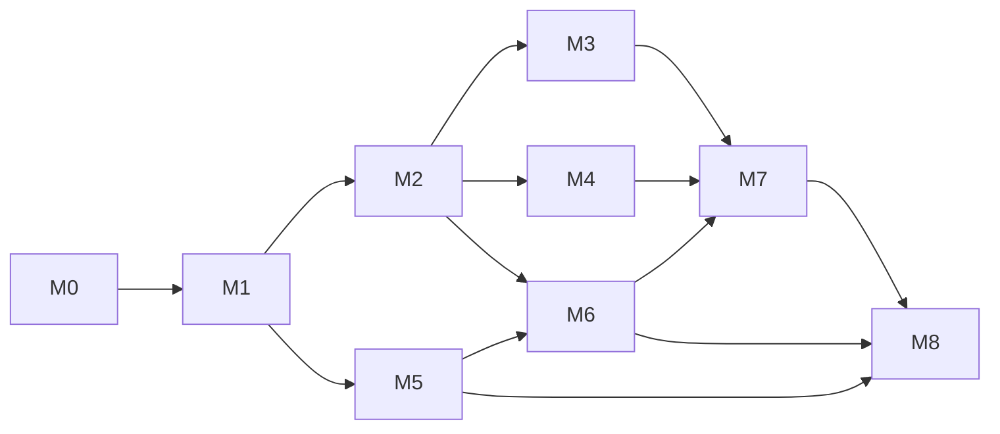

# Roadmap — program milestones M0–M8

The program's milestone list is **authoritative**; this roadmap maps the platform
work onto it. M0 is defined by the orchestrator's baseline report
(`docs/evidence/m0-baseline-report.md`, orchestrator-owned). The milestone
definitions below were confirmed by the orchestrator on 2026-10-08 (an earlier
draft numbering is superseded).

Status vocabulary: `implemented` / `partial` / `proposed`. Blocked cells name the
missing tool and the command that would unblock them. Dates are deliberately
omitted: each milestone gates on its exit criteria, not on a calendar.

## 1. Milestone overview

| Milestone | Program scope | Outcome | Depends on | Primary ADR |
| --- | --- | --- | --- | --- |
| **M0** | Charter + baseline | Intake, baseline reproduced, charter, architecture, threat model, ADRs, legacy record, ledger skeleton | — | all |
| **M1** | Contracts + enforcement | Native versioned contracts with a policy/code revision in every decision; legacy adapter isolated; enforcement binding and integration SDK | M0 | ADR-0006 |
| **M2** | Auth + policy + audit store | Authentication and tenancy; versioned policy; durable append-only receipt/audit store | M1 | ADR-0001, ADR-0002 |
| **M3** | Observability + reliability | OpenTelemetry, Prometheus, Grafana, SLOs, fail-closed guarantees under load | M1, M2 | ADR-0003 |
| **M4** | CI/CD + containers + deployment | Pipelines and gates; hardened Compose stack; Kubernetes manifests validated and smoke-tested | M1, M2 | ADR-0005 |
| **M5** | Evaluation framework + benchmark data | Native evaluation schema authoritative; versioned legacy adapter; benchmark data + reachability gate | M1 | ADR-0004 |
| **M6** | Empirical campaign | Real-model runs, multi-seed variance, component ablations, generalization | M2, M5 | ADR-0004 |
| **M7** | Independent review | Adversarial and security review of the new surfaces; reproducibility audit | M3, M4, M6 | all |
| **M8** | Docs + demo + release | Documentation, demo, versioned release, provenance manifest | M5, M6, M7 | all |

### M0 execution status (this milestone)

- **Entry:** legacy baseline `649f65a` reproduced in the integration worktree.
- **Exit:** `AGENTS.md`, `PRODUCT.md`, `README.md`, system context, threat model,
  six ADRs, roadmap, legacy record + evidence map, and the ledger skeleton merged;
  `python -m pytest -q` green.
- **Blocked:** nothing.

## 2. Dependency graph

Hard ordering rules:

1. **Contracts + enforcement (M1) precede everything.** Every later milestone
   imports the versioned request/response/receipt models, and every receipt must
   carry the policy version and code commit that produced it (see the M0
   reproduction finding in [`../evidence/ledger.md`](../evidence/ledger.md) row
   L14). Changing contracts after M2 forces a migration and invalidates stored
   receipts.
2. **Auth + policy + audit store (M2) precede observability and deployment.**
   Auth decisions, policy versions and telemetry exports all persist; they need a
   stable schema.
3. **Evaluation framework (M5) can run in parallel with M2–M4** — it depends only
   on M1 — but its native results are not a release gate until M8.
4. **The empirical campaign (M6) needs M5 (harness) and M2 (stored policy/code
   revision in every result).**
5. **Independent review (M7) follows the empirical campaign and a deployable
   stack**; it reviews evidence, not intentions.
6. **Release (M8) is last.**

## 3. Milestone detail

### M0 — Charter and baseline *(this milestone, complete)*

Baseline reproduced (`187 passed`, Ruff and mypy clean), charter and architecture
written, ADRs proposed, legacy evidence mapped, ledger seeded. See the handoff
for the exact commits.

### M1 — Contracts + enforcement

- **Entry:** M0 merged. Baseline suite green.
- **Work:** extract a versioned native decision/receipt schema; carry an explicit
  **policy version and source code revision** in every decision, receipt,
  scorecard and artifact; isolate the legacy SENTINEL wire contract behind a
  `legacy/` adapter so both evolve without drift; build the enforcement adapter
  that refuses an action whose digest does not match the receipt, plus the
  integration SDK (escalation resume, rewrite re-validation).
- **Exit:** contract tests for both surfaces; no scenario/tenant id in a decision
  path; legacy wire contract byte-compatible; a digest-mismatched action is
  refused; an escalated action executes only after a matching confirmation.
- **Risk:** shared contracts have the highest blast radius — single writer only.
- **Security exit:** the F4–F7 regression criteria are covered by tests (see the
  findings map immediately below); F1–F3 stay open by design until M2.
- **ADR:** ADR-0006.

### Security findings → milestones

The M0 adversarial review produced 10 findings, `F1`–`F10`, registered with their
severities, preconditions and per-finding regression criteria in
[`../evidence/security-findings.md`](../evidence/security-findings.md). That
register is the source of record (orchestrator-owned; read-only here); this map
only assigns each finding to the milestone that closes it.

| Finding | Severity | Subject | Closed in |
| --- | --- | --- | --- |
| F1 | high (critical if internet-reachable) | Unauthenticated decision boundary; caller supplies every security-relevant input | M2 |
| F2 | high | Confirmation self-granted inside the same envelope | M2 |
| F3 | high | Attacker-declared trust/sensitivity labels and policy facts | M2 |
| F4 | high | Algorithmic-complexity DoS in claim scanning | **M1** |
| F5 | medium | Unbounded request body | **M1** |
| F6 | medium | Non-injective canonical-digest matching; unbound, unexpiring, reusable grants | **M1** (new surface only) |
| F7 | medium | No decision identity, receipt or audit record at the wire boundary | **M1** partially (identity + emitted record); M2 owns the durable store |
| F8 | low | Dependency pins carry no hashes | M4 |
| F9 | medium (evidence fidelity) | Suite environment differs from the shipped image | M3 (CI runs the suite in the image) / M4 |
| F10 | low | Application directory writable by the runtime user | M4 |

**M1 closes F4, F5, F6 on the new surface and F7 partially** (identity plus one
emitted decision record; the append-only store is M2's). **M1 leaves open**
F1, F2 and F3, which M2 closes with authenticated, tenant-scoped policy and
server-issued grants — an unauthenticated body cap or digest binding is not an
authorization control. F8 and F10 close in M4 (hashed dependency pins, read-only
root filesystem); F9 remains open until CI runs the suite inside the built image
(M3/M4). F6's **legacy** matching rule is deliberately unchanged in M1: any change
there requires a new evaluation artifact, never an edit of the frozen scorecards
in [`../evidence/ledger.md`](../evidence/ledger.md).

### M2 — Auth + policy + audit store

- **Entry:** M1 frozen contracts.
- **Work:** OIDC/JWT for interactive principals plus scoped service tokens for
  machine callers (ADR-0002); per-tenant authorization on every read and write;
  an explicit policy store with versions and an audit trail; PostgreSQL +
  SQLAlchemy 2 + Alembic with an append-only `receipts` table keyed by request id
  and action digest (ADR-0001).
- **Exit:** migration from empty DB applies cleanly; a receipt round-trips and a
  mutated receipt is rejected; unauthenticated access rejected; cross-tenant
  reads denied; policy version changes are auditable and attributable.
- **Blocked locally:** no host `psql`; the intended path is containerized
  PostgreSQL via Docker. Until then the store is exercised through the container
  only — do not substitute SQLite and call it verified.
- **ADRs:** ADR-0001, ADR-0002.

### M3 — Observability + reliability

- **Entry:** M2 store and principals.
- **Work:** OpenTelemetry traces across boundary → adapter → kernel → store;
  Prometheus counters/histograms (decisions by verdict/reason, latency, failures,
  enforcement outcomes); Grafana dashboards; SLOs for decision latency and
  fail-closed rate; load and failure-injection tests proving the gateway stays
  fail-closed.
- **Exit:** a decision emits a trace and increments metrics; dashboards render
  real data; no content or secrets in telemetry attributes; the fail-closed
  invariant holds under fault injection.
- **ADR:** ADR-0003.

### M4 — CI/CD + containers + deployment

- **Entry:** M1, M2.
- **Work:** CI pipelines running tests, Ruff, mypy and the reachability gate;
  hardened Compose stack (service + PostgreSQL + Prometheus + Grafana); container
  image build and live run verification; Kubernetes manifests validated by schema
  tooling.
- **Exit:** Compose stack starts from a clean machine and passes a smoke test;
  image runs non-root with the documented hardening; Kubernetes manifests
  validate (`kubectl apply --dry-run=server` or equivalent).
- **Blocked:** Kubernetes **cluster smoke test** needs `kind` (not installed).
  Command when available:
  `kind create cluster --name aegisgraph && kubectl apply -k deploy/k8s`.
  Report this cell as `blocked`.
- **ADR:** ADR-0005.

### M5 — Evaluation framework + benchmark data

- **Entry:** M1 contracts.
- **Work:** a native evaluation schema authoritative for platform claims; the
  legacy SENTINEL suite preserved behind a versioned, read-only adapter; the
  allow-all reachability control generalized into the native harness; benchmark
  data versioned with digests; optional Inspect AI integration (e.g. AgentDojo).
- **Exit:** a native run produces a scorecard with a deterministic digest and the
  policy/code revision; the legacy adapter reproduces the preserved baseline
  without editing the legacy artifacts; reachability gate mandatory in CI.
- **ADR:** ADR-0004.

### M6 — Empirical campaign

- **Entry:** M2 (stored revision), M5 (harness).
- **Work:** real-model runs on the pinned and native suites; multi-seed variance;
  component ablations; generalization to an unseen tool schema; every result
  labelled synthetic or real with its revision fingerprint.
- **Exit:** a reported campaign with variance/confidence, ablations, and a
  reproducibility package a third party can re-run.
- **Blocked:** real-model runs need `ollama` (or an authorized API). Neither is
  available; synthetic runs are labelled and cannot substitute.
- **ADR:** ADR-0004.

### M7 — Independent review

- **Entry:** M3, M4, M6.
- **Work:** adversarial and security review of the new surfaces (API boundary,
  store, auth, telemetry); reproducibility audit of every headline claim;
  independent re-run of the evaluation gates.
- **Exit:** findings triaged with severity; every "complete" claim independently
  verified or explicitly blocked; the ledger is complete.

### M8 — Docs + demo + release

- **Entry:** M5, M6, M7.
- **Work:** documentation truth pass; a demo of a decided, enforced action with a
  receipt; versioned release with a provenance manifest (paths + SHA-256);
  dependency audit; migrate the legacy evidence links.
- **Exit:** every headline claim in [`../evidence/ledger.md`](../evidence/ledger.md)
  is `verified` with an artifact, digest, command and commit, or explicitly
  `blocked` with the missing tool.

## 4. Blocked-by-tooling ledger

| Capability | Milestone | Status | Missing tool | Unblock command / condition |
| --- | --- | --- | --- | --- |
| Kubernetes cluster smoke test | M4 | blocked | `kind` | `kind create cluster --name aegisgraph` |
| PostgreSQL on the host | M2 | blocked | `psql` | containerized PostgreSQL (Docker) is the intended path |
| Real-model evaluation reruns | M6 | blocked | `ollama` | install `ollama` + `qwen3:8b`, or authorize an API |
| Paid-model benchmarking | M6 | blocked | API credentials | explicit owner authorization |
| Docker-engine live run | M4 | available | — | `docker build` + `docker run` (Docker 29.6.2 present) |

## 5. Single-writer map

One writer per path. Multiple agents may work in parallel only on disjoint files.
The orchestrator arbitrates conflicts and owns the shared files.

### Orchestrator-owned (nobody else edits)

| Path | Reason |
| --- | --- |
| `pyproject.toml`, `requirements.lock` | Dependency and interpreter contract |
| `benchmark.lock` | Pinned legacy benchmark identity |
| `Dockerfile`, `.dockerignore` | Build contract |
| `.github/**` | CI and gates |
| `backend/aegisgraph/contracts.py` | Shared canonical contract (highest blast radius) |
| `docs/evidence/m0-baseline-report.md` | Orchestrator baseline record |
| `AGENTS.md`, `PRODUCT.md`, `README.md` | Shared operating/product docs |
| `docs/architecture/**` | Charter (this agent, M0 only) |

### Per-milestone ownership (proposed)

| Milestone | Writer role | Owned paths |
| --- | --- | --- |
| M1 | Contracts/API implementer + integration | `backend/aegisgraph/sentinel.py`, new `backend/aegisgraph/legacy/**`, new `backend/aegisgraph/enforce/**`, new `sdk/**`, `tests/test_contracts.py`, `tests/test_enforcement.py` |
| M2 | Persistence engineer + security engineer | new `backend/aegisgraph/store/**`, `migrations/**`, new `backend/aegisgraph/auth/**`, new `backend/aegisgraph/policy_store/**`, `tests/test_store.py`, `tests/test_auth.py` |
| M3 | Platform/telemetry engineer | new `backend/aegisgraph/telemetry/**`, `deploy/observability/**`, `tests/test_telemetry.py` |
| M4 | Platform engineer | `.github/workflows/**` (with orchestrator), new `deploy/**`, `docs/runbooks/**` |
| M5 | Evaluation engineer | `evaluation/**` (add-only; never edit legacy artifacts), new `evaluation/native/**`, `scripts/**` |
| M6 | Evaluation engineer + research analyst | `evaluation/campaign/**`, `docs/research/**` |
| M7 | Independent reviewers | read-only findings; `docs/review/**` |
| M8 | Orchestrator + documentation writer | release manifest, `docs/evidence/ledger.md`, release notes |

### Never shared mid-flight

- The legacy evidence under `evaluation/real-qwen/**` is **add-only**. New
  artifacts get new names; existing digests are never recomputed or edited.
- `backend/aegisgraph/engine.py` is a single-writer file: policy changes are one
  writer at a time, with a component ablation and a matched evaluation rerun.
- Any change to a shared contract (`contracts.py`, `sentinel.py`) must land
  before dependent milestone work begins, not in parallel with it.

## 6. Gate for every milestone

Each milestone exit runs, in the integration worktree: `python -m pytest -q`,
`python -m ruff check backend tests`, `python -m mypy`, plus the milestone's own
smoke run. The orchestrator independently verifies each "complete" claim and
updates `docs/evidence/ledger.md` before the milestone is closed.
