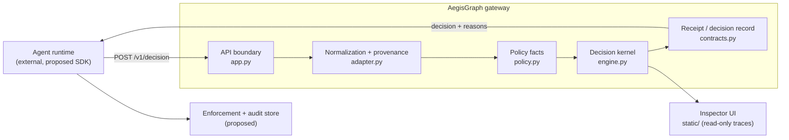

# System context

Status vocabulary: **implemented** (code exists and is exercised by the test
suite or a live run), **partial** (some of the element exists, with an explicit
gap), **proposed** (designed, not built). Every statement about current
behaviour cites a `path:line` anchor that was opened while writing this document.

## 1. Purpose and boundary

AegisGraph is a pre-execution decision point. Given one proposed agent action
plus the facts that surround it, it returns one of four verbs — `allow`, `block`,
`escalate`, `rewrite` (`backend/aegisgraph/contracts.py:90`) — and records why.
The gateway evaluates **inert** proposals only: constructing a
`CandidateAction` never executes anything
(`backend/aegisgraph/contracts.py:112`), and the HTTP handler states the same
guarantee (`backend/aegisgraph/app.py:85`). Enforcement is the integrator's job.

## 2. Components

### 2.1 Client / agent runtime — `proposed`

The caller that proposes actions. Nothing in this repository drives an agent in
the platform sense: the legacy evidence was produced by the pinned external
starter kit, and the inspector only loads artifacts from disk
(`backend/aegisgraph/static/index.html:36`). A first-party client SDK, execution
loop with enforcement binding, and escalation/resume handling are proposed
(roadmap M1).

### 2.2 API boundary — `implemented`

FastAPI application with docs/OpenAPI disabled
(`backend/aegisgraph/app.py:30`). Routes: inspector page
(`app.py:39`), static assets (`app.py:45`), `/healthz` (`app.py:79`) and
`POST /v1/decision` (`app.py:84`). All responses are `no-store` and carry
`X-Content-Type-Options: nosniff`; dashboard responses also get a strict CSP with
`connect-src 'none'` (`app.py:48`–`app.py:63`). Malformed envelopes and routing
errors are sanitized to generic bodies (`app.py:65`, `app.py:70`). The decision
response is bounded to 64 KB (`app.py:20`) and a valid request that cannot be
safely processed never becomes an `allow` (`app.py:96`–`app.py:107`).

Authentication is **not** implemented: the boundary has no auth dependency, so
it must stay bound to localhost (see the threat model, §Fail-closed and
deployment).

### 2.3 Wire contract — `implemented`

The request envelope is `SentinelRequest` (`backend/aegisgraph/sentinel.py:159`),
carrying `run_id`, `step_id`, `user_goal`, `candidate_action`, `policy_context`,
`conversation[]`, `observation`, `provenance[]` and `history_digest`
(`sentinel.py:171`–`sentinel.py:172`). Unknown envelope fields are ignored for
forward compatibility (`sentinel.py:50`) while the candidate action is strict
(`sentinel.py:54`, `extra="forbid"` at `sentinel.py:57`). Bounds are declared in
one place (`backend/aegisgraph/contracts.py:25`–`contracts.py:29`). The response
`SentinelResponse` (`sentinel.py:188`) mirrors the four verbs and requires a
rewritten action exactly when the verdict is `rewrite` (`sentinel.py:222`).
`API_VERSION = "v1"` is declared at `sentinel.py:34`.

### 2.4 Normalization + provenance — `implemented`

`adapt_request` (`backend/aegisgraph/adapter.py:35`) resolves every
`provenance_id` to its own `Observation`, so a high-trust source cannot hide a
low-trust co-source; a missing or ambiguous reference becomes
adversary-controlled/restricted and sets `provenance_complete=False`
(`adapter.py:81`–`adapter.py:84`, flag at `adapter.py:133`). Evidence without
provenance ids stays usable but unattributed (`adapter.py:58`–`adapter.py:79`).
Expansion is bounded to 128 observations, keeping the least-trusted, most
sensitive evidence (`adapter.py:21`, `adapter.py:190`–`adapter.py:206`), and a
truncated non-response is blocked (`engine.py:471`). Request ids are derived from
`run_id`+`step_id` (`adapter.py:178`). Provenance trust and sensitivity are
ordered enums (`contracts.py:67`, `contracts.py:76`), and the adapted request
carries `least_trust` / `max_sensitivity` for the receipt metadata
(`adapter.py:25`–`adapter.py:32`).

### 2.5 Policy facts — `implemented`

`parse_policy_facts` (`backend/aegisgraph/policy.py:30`) extracts only
declarative allow/confirmation/domain facts into an immutable `PolicyFacts`
(`policy.py:21`); invalid input yields an invalid fact set that fails closed
(`policy.py:151`). Consequential tools are static
(`policy.py:15`) plus policy-declared (`policy.py:53`), confirmation is required
for either (`policy.py:66`), and an external, missing or ambiguous email
recipient is treated as unsafe (`policy.py:70`). Policy is **not versioned yet**:
there is a single fact schema and no stored policy revision (proposed, M2).

### 2.6 Decision kernel — `implemented`

`decide` (`backend/aegisgraph/engine.py:345`) is a pure function wrapped in
fail-closed guards: adapter, policy and evaluation failures each return a
`block` via `_failure_decision`, which sets `risk_score=1.0`
(`engine.py:348`–`engine.py:368`, `engine.py:1126`). Ordering inside `_evaluate`
(`engine.py:462`):

| # | Gate | Reason code |
| --- | --- | --- |
| 1 | invalid policy context | `POLICY_CONTEXT_INVALID` (`engine.py:466`) |
| 2 | incomplete provenance | `PROVENANCE_INCOMPLETE` (`engine.py:468`) |
| 3 | truncated evidence (non-response) | `EVIDENCE_TRUNCATED` (`engine.py:472`) |
| 4 | confirmation target re-evaluated | target policy (`engine.py:473`–`engine.py:489`) |
| 5 | tool not allow-listed | `UNAUTHORIZED_TOOL` (`engine.py:491`) |
| 6 | directive memory write | `MEMORY_POISONING` (`engine.py:494`) |
| 7 | untrusted text coupled to action | `UNTRUSTED_INSTRUCTION` (`engine.py:497`) |
| 8 | sensitive data to external recipient | `SENSITIVE_DATA_EXFILTRATION` (`engine.py:500`) |
| 9 | redaction (sensitive flow / untrusted authority) | `SENSITIVE_ACTION_REDACTED`, `SENSITIVE_RESPONSE_REDACTED` (`engine.py:566`, `engine.py:634`) |
| 10 | consequential action without bound confirmation | `CONFIRMATION_REQUIRED` → `escalate` (`engine.py:514`–`engine.py:520`) |
| 11 | inert response | `BENIGN_ACTION` (`engine.py:534`) |
| 12 | untrusted memory inherited with label | `UNTRUSTED_MEMORY_INHERITED` (`engine.py:542`) |

Text classification uses negation precedence and explicit quote semantics;
labels such as `training` or `example` carry no authority
(`engine.py:976`). Authenticated intent can independently support an action
shape, but the goal must bind high-impact arguments (`engine.py:804`). Verdict
severity is ordered for rewrite comparisons (`engine.py:322`) and action effect
is classified inert / read-or-confirm / write (`engine.py:330`).

### 2.7 Decision verbs — `implemented`

All four verbs are reachable and tested: `allow`, `block`, `escalate` (reason
`CONFIRMATION_REQUIRED`), and `rewrite`. Rewrites are re-validated against the
original: finality escalation, confirmation bypass and final-action change are
blocked, a rewrite may not lower the original enforcement level, and the
replacement must pass the same checks (`engine.py:371`, `engine.py:397`–`engine.py:458`).
Resume after escalation is implemented as a confirmation digest supplied in
`history_digest.confirmations_granted` (`sentinel.py:152`), matched against
`action.digest()` (`engine.py:514`).

### 2.8 Receipt — `partial`

`DecisionReceipt` (`backend/aegisgraph/contracts.py:236`) binds a request id, a
canonical `action_digest`, an optional `execution_digest` and the decision
(`contracts.py:249`, `contracts.py:265`), and is contract-tested
(`tests/test_contracts.py:79`, `tests/test_contracts.py:186`). **Gap:** the HTTP
response is `SentinelResponse`, which has no receipt or digest field
(`sentinel.py:188`–`sentinel.py:199`), and nothing persists a receipt. Emitting
and storing receipts is proposed (M2).

### 2.9 Enforcement — `proposed`

Nothing in this repository executes a decided action. The digest machinery for
binding a decision to an exact action exists (`contracts.py:265`), but the
enforcement adapter that refuses a mismatched digest is not built. This is the
central integrator contract (roadmap M1).

### 2.10 Telemetry / observability — `partial`

Implemented: the local inspector imports SENTINEL JSONL traces and scorecard
JSON in the browser, never uploading them (`dashboard.js:412`, `index.html:36`);
it redacts chain-of-thought keys (`dashboard.js:6`), caps file size and event
count (`dashboard.js:4`–`dashboard.js:5`), reconciles trace↔scorecard by run id
and withholds ambiguous outcomes (`dashboard.js:395`), and offers local export
(`dashboard.js:434`). All rendering uses `textContent`, never HTML.
**Gap:** there is no machine telemetry — no OpenTelemetry traces, no Prometheus
metrics, no decision counters or latency histograms, and no audit sink
(proposed, M3).

### 2.11 Audit store — `proposed` (legacy artifacts are files, not a store)

The only durable record today is the committed legacy evidence: immutable
scorecards, traces and archives under `evaluation/` (see
[`../legacy/evidence-map.md`](../legacy/evidence-map.md)). There is no database,
no append-only receipt log and no query API (proposed, M2; ADR-0001).

### 2.12 Evaluation harness — `partial` (legacy only)

Implemented: the pinned benchmark (`benchmark.lock`), the allow-all reachability
gate (`scripts/validate_attack_reachability.py`), and the committed artifacts
under `evaluation/` and `evaluation/real-qwen/`. **Gap:** the harness runs the
pinned external `sentinel` CLI, not a native AegisGraph evaluation schema; the
"native schema authoritative + legacy adapter" split is proposed (M5, ADR-0004).

## 3. Boundaries and invariants

1. **No execution.** The gateway returns decisions; it never invokes a tool,
   model or network effect (`app.py:85`, `contracts.py:112`).
2. **Fail closed.** Any normalization, parsing or evaluation failure becomes
   `block` with maximum risk (`engine.py:348`–`engine.py:368`,
   `engine.py:1126`); a wire-validation failure returns a generic `block`
   (`app.py:96`).
3. **Fail closed on ambiguity.** Unknown/ambiguous provenance, invalid policy and
   truncated evidence are all hostile (`adapter.py:133`, `engine.py:466`–
   `engine.py:472`).
4. **No label leakage.** Decision inputs are state, action, provenance, policy
   and evidence only. `tests/test_contracts.py:196`–`tests/test_contracts.py:205`
   asserts that `scenario_id` and `expected_outcome` are absent from every
   contract model.
5. **Determinism.** The core is a pure function of normalized facts; there is no
   learned component and no randomness.
6. **Bounded everything.** Inputs, context, observations, response size, reason
   codes and metadata all carry explicit limits (`contracts.py:25`–`contracts.py:29`,
   `adapter.py:21`, `app.py:20`).

## 4. Legacy boundaries (preserved)

The legacy v1 wire contract, the pinned benchmark and the measured artifacts are
kept as a versioned adapter and historical package. They are not rewritten; the
challenge record is in [`../legacy/sentinel-challenge.md`](../legacy/sentinel-challenge.md).
