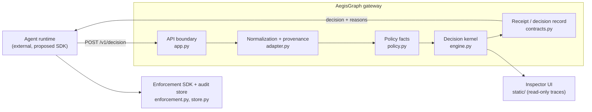

# System context

Status vocabulary: **implemented** (code exists and is exercised by the test
suite or a live run), **partial** (some of the element exists, with an explicit
gap), **proposed** (designed, not built). Every statement about current
behaviour cites a `path:line` anchor that was opened while writing this document.

Statuses mirror the evidence ledger ([`../evidence/ledger.md`](../evidence/ledger.md));
where this document and the ledger disagree, **the ledger governs**. Sections
2.1–2.3 and 2.8–2.12 were re-stated against the ledger at the `v0.1.0-industrial`
release; the anchors in §2.4–§2.7 were opened at M0 and are unchanged.

## 1. Purpose and boundary

AegisGraph is a pre-execution decision point. Given one proposed agent action
plus the facts that surround it, it returns one of four verbs — `allow`, `block`,
`escalate`, `rewrite` (`backend/aegisgraph/contracts.py:90`) — and records why.
The gateway evaluates **inert** proposals only: constructing a
`CandidateAction` never executes anything
(`backend/aegisgraph/contracts.py:112`), and the HTTP handler states the same
guarantee (`backend/aegisgraph/app.py:85`). Enforcement is the integrator's job.

## 2. Components

### 2.1 Client / agent runtime — `partial`

The caller that proposes actions. Nothing in this repository hosts a general
agent runtime: the legacy evidence was produced by the pinned external starter
kit, and the inspector only loads artifacts from disk
(`backend/aegisgraph/static/index.html:36`). Two first-party drivers do exist and
are exercised: the **enforcement SDK** (`backend/aegisgraph/enforcement.py` with
`examples/enforce_decision.py`, offline and live — ledger P6, P12) and the
**benchmark runner** (`benchmark/runner.py` + `benchmark/wire.py`, which drives
the gateway for every native run — ledger P21, P68). A third-party agent SDK and
a hosted execution loop remain `proposed`.

### 2.2 API boundary — `implemented`

FastAPI application with docs/OpenAPI disabled
(`backend/aegisgraph/app.py:30`). Routes: inspector page
(`app.py:39`), static assets (`app.py:45`), `/healthz` (`app.py:79`) and
`POST /v1/decision` (`app.py:84`). All responses are `no-store` and carry
`X-Content-Type-Options: nosniff`; dashboard responses also get a strict CSP with
`connect-src 'none'` (`app.py:48`–`app.py:63`). Malformed envelopes and routing
errors are sanitized to generic bodies (`app.py:65`, `app.py:70`). The decision
response is bounded to 64 KB (`app.py:20`) and a valid request that cannot be
safely processed never becomes an `allow` (`app.py:96`–`app.py:107`).

Authentication **is** implemented (ledger P3): every decision carries a
credential, `AUTH_MODE` is explicit (`required` in production, `none` only for a
loopback development process), an anonymous `POST /api/v1/decisions` returns
`401`, a credential missing a scope returns `403` naming the scope, and reads are
tenant-scoped (`404` for another tenant's receipt). The native surface also
serves `GET /api/v1/version` (build and policy identity, ledger P1), `/readyz`
(dependency-aware readiness) and `/metrics`; the legacy `POST /v1/decision` stays
loopback-only and production refuses to start with it enabled.

### 2.3 Wire contract — `implemented`

The request envelope is `SentinelRequest` (`backend/aegisgraph/sentinel.py:159`),
carrying `run_id`, `step_id`, `user_goal`, `candidate_action`, `policy_context`,
`conversation[]`, `observation`, `provenance[]` and `history_digest`
(`sentinel.py:171`–`sentinel.py:172`). Unknown envelope fields are ignored for
forward compatibility (`sentinel.py:50`) while the candidate action is strict
(`sentinel.py:54`, `extra="forbid"` at `sentinel.py:57`). Bounds are declared in
one place (`backend/aegisgraph/contracts.py:25`–`contracts.py:29`). The response
`SentinelResponse` (`sentinel.py:188`) mirrors the four verbs and requires a
rewritten action exactly when the verdict is `rewrite` (`sentinel.py:222`).
`API_VERSION = "v1"` is declared at `sentinel.py:34`. Alongside it the platform
serves the **native versioned contract** `aegisgraph/v1`
(`docs/api/contracts.md`, `docs/api/decision.schema.json`,
`backend/aegisgraph/api_v1.py`), which carries the policy set, a server-generated
`request_id`, a `receipt_id` and both digests in every decision (ledger P1, P11).
The legacy envelope above is preserved unchanged behind that surface.

### 2.4 Normalization + provenance — `implemented`

`adapt_request` (`backend/aegisgraph/adapter.py:35`) resolves every
`provenance_id` to its own `Observation`, so a high-trust source cannot hide a
low-trust co-source; a missing or ambiguous reference becomes
adversary-controlled/restricted and sets `provenance_complete=False`
(`adapter.py:81`–`adapter.py:84`, flag at `adapter.py:133`). Evidence without
provenance ids stays usable but unattributed (`adapter.py:58`–`adapter.py:79`).
Expansion is bounded to 128 observations, keeping the least-trusted, most
sensitive evidence (`adapter.py:21`, `adapter.py:190`–`adapter.py:206`), and a
truncated non-response is blocked (`engine.py:471`). Request ids are derived from
`run_id`+`step_id` (`adapter.py:178`). Provenance trust and sensitivity are
ordered enums (`contracts.py:67`, `contracts.py:76`), and the adapted request
carries `least_trust` / `max_sensitivity` for the receipt metadata
(`adapter.py:25`–`adapter.py:32`).

### 2.5 Policy facts — `implemented`

`parse_policy_facts` (`backend/aegisgraph/policy.py:30`) extracts only
declarative allow/confirmation/domain facts into an immutable `PolicyFacts`
(`policy.py:21`); invalid input yields an invalid fact set that fails closed
(`policy.py:151`). Consequential tools are static
(`policy.py:15`) plus policy-declared (`policy.py:53`), confirmation is required
for either (`policy.py:66`), and an external, missing or ambiguous email
recipient is treated as unsafe (`policy.py:70`). Policy **is** versioned (ledger P3, P26, P41): a stored policy store with
publish/activate (`POST /api/v1/policies`, `…/{policy_id}/activate`, each
recording a content `checksum`), an audit-event feed (`GET /api/v1/audit-events`),
a server-resolved `policy_set` in every decision, `422 POLICY_SET_UNKNOWN` for a
name the server does not hold, and `policy.blob_sha256` (plus the policy source
blobs) recorded in every run manifest. No cryptographic signature is applied to a
policy document — the identity is content-addressed, not signed.

### 2.6 Decision kernel — `implemented`

`decide` (`backend/aegisgraph/engine.py:345`) is a pure function wrapped in
fail-closed guards: adapter, policy and evaluation failures each return a
`block` via `_failure_decision`, which sets `risk_score=1.0`
(`engine.py:348`–`engine.py:368`, `engine.py:1126`). Ordering inside `_evaluate`
(`engine.py:462`):

| # | Gate | Reason code |
| --- | --- | --- |
| 1 | invalid policy context | `POLICY_CONTEXT_INVALID` (`engine.py:466`) |
| 2 | incomplete provenance | `PROVENANCE_INCOMPLETE` (`engine.py:468`) |
| 3 | truncated evidence (non-response) | `EVIDENCE_TRUNCATED` (`engine.py:472`) |
| 4 | confirmation target re-evaluated | target policy (`engine.py:473`–`engine.py:489`) |
| 5 | tool not allow-listed | `UNAUTHORIZED_TOOL` (`engine.py:491`) |
| 6 | directive memory write | `MEMORY_POISONING` (`engine.py:494`) |
| 7 | untrusted text coupled to action | `UNTRUSTED_INSTRUCTION` (`engine.py:497`) |
| 8 | sensitive data to external recipient | `SENSITIVE_DATA_EXFILTRATION` (`engine.py:500`) |
| 9 | redaction (sensitive flow / untrusted authority) | `SENSITIVE_ACTION_REDACTED`, `SENSITIVE_RESPONSE_REDACTED` (`engine.py:566`, `engine.py:634`) |
| 10 | consequential action without bound confirmation | `CONFIRMATION_REQUIRED` → `escalate` (`engine.py:514`–`engine.py:520`) |
| 11 | inert response | `BENIGN_ACTION` (`engine.py:534`) |
| 12 | untrusted memory inherited with label | `UNTRUSTED_MEMORY_INHERITED` (`engine.py:542`) |

Text classification uses negation precedence and explicit quote semantics;
labels such as `training` or `example` carry no authority
(`engine.py:976`). Authenticated intent can independently support an action
shape, but the goal must bind high-impact arguments (`engine.py:804`). Verdict
severity is ordered for rewrite comparisons (`engine.py:322`) and action effect
is classified inert / read-or-confirm / write (`engine.py:330`).

### 2.7 Decision verbs — `implemented`

All four verbs are reachable and tested: `allow`, `block`, `escalate` (reason
`CONFIRMATION_REQUIRED`), and `rewrite`. Rewrites are re-validated against the
original: finality escalation, confirmation bypass and final-action change are
blocked, a rewrite may not lower the original enforcement level, and the
replacement must pass the same checks (`engine.py:371`, `engine.py:397`–`engine.py:458`).
Resume after escalation is implemented as a confirmation digest supplied in
`history_digest.confirmations_granted` (`sentinel.py:152`), matched against
`action.digest()` (`engine.py:514`).

### 2.8 Receipt — `implemented`

`DecisionReceipt` (`backend/aegisgraph/contracts.py:236`) binds a request id, a
canonical `action_digest`, an optional `execution_digest` and the decision
(`contracts.py:249`, `contracts.py:265`), and is contract-tested
(`tests/test_contracts.py:79`, `tests/test_contracts.py:186`). The **native**
surface emits and stores receipts (ledger P11, P2): every `POST
/api/v1/decisions` response carries a server-generated `request_id`, a
`receipt_id`, the policy set, both digests and a validity window, and the receipt
is persisted append-only per tenant, keyed by `(tenant_id, request_id)` — a
changed action under the same `request_id` is refused with `409`, and an
idempotent replay returns the stored body byte-identically (migration
`0002_receipt_decision_body`, ledger P55). **Residual:** the preserved legacy
`POST /v1/decision` still answers with `SentinelResponse`
(`sentinel.py:188`–`sentinel.py:199`), which has no receipt field — that wire is
kept unchanged for the pinned harness (ledger L16).

### 2.9 Enforcement — `implemented` (inert executor)

The enforcement SDK exists: `enforce` (`backend/aegisgraph/enforcement.py:66`)
refuses with one of eight `RefusalReason` values (`enforcement.py:26`), including
`DIGEST_MISMATCH` (`enforcement.py:32`) when the candidate action is not the
action the receipt was issued for; the executor is **never invoked on a
refusal**, and `examples/enforce_decision.py` demonstrates both the approved and
the tampered path offline and against a live gateway (ledger P6, P12).
**Residual:** the shipped executor is an **inert simulated toolbox** — it
produces a `ToolResult` and no real side effect; connecting a real tool is the
integrator's job (roadmap M6/M7 territory), and receipt validity is checked
caller-side by the SDK, backed by the durable store above.

### 2.10 Telemetry / observability — `implemented`

Implemented (ledger P4, P7): `backend/aegisgraph/telemetry.py` exports **8
`aegisgraph_*` Prometheus families** (`requests_total`,
`decisions_total{policy_id,verdict}`, `decision_latency_seconds`, an
export-failure counter, …) with **no tenant, principal, request, receipt or
content label**, and an OpenTelemetry trace per decision; the exporter is
non-blocking, so an unreachable collector leaves the decision path unaffected and
the failure is *counted* rather than raised. `deploy/observability/**` carries the
single Prometheus scrape config (with the `aegisgraph-api` job), the Grafana
provisioning and the 10-panel `aegisgraph-service` dashboard, and the OTel
collector config; `docs/ops/observability.md` and `docs/ops/slo.md` document the
label vocabulary, the health semantics and the SLOs. The load harness
(`scripts/load_test.py`) produces the committed baseline
`docs/evidence/performance/m3-load-20261008T210436Z.json` (2986 measured
requests, warm-up excluded, 148.938 req/s, in-process p50 2.302 / p95 5.227 /
p99 7.283 ms, 0 errors), and failure-injection tests cover database-down,
collector-down, cancellation and overload.

The local inspector is unchanged: it imports SENTINEL JSONL traces and scorecard
JSON in the browser, never uploading them (`dashboard.js:412`, `index.html:36`),
redacts chain-of-thought keys (`dashboard.js:6`), caps file size and event count
(`dashboard.js:4`–`dashboard.js:5`), reconciles trace↔scorecard by run id and
withholds ambiguous outcomes (`dashboard.js:395`), and offers local export
(`dashboard.js:434`). All rendering uses `textContent`, never HTML.

**Residuals (ledger P80, P84, accepted):** the `/metrics` control is
**port-level only** — no authentication dependency, so anything permitted to
reach port 8080 can read the content-free exposition, and the network is the
control; and one span attribute (`policy_set.version` for override decisions) is
caller-controlled and unbounded in distinct values, so a collector that derives
span metrics must drop or map that dimension. **Still open:** no cluster smoke
test (`kind` absent) and the suite is not yet run **inside** the shipped image
(F9).

### 2.11 Audit store — `implemented`

The durable record is a **PostgreSQL 17 store** (SQLAlchemy 2 + Alembic,
`backend/aegisgraph/store.py`, `backend/aegisgraph/models.py`,
`backend/migrations/versions/{0001_initial,0002_receipt_decision_body}.py`):
receipts are append-only, keyed by `(tenant_id, request_id)` and action digest,
readable per tenant (another tenant's receipt is `404`), with an idempotent
replay returning the stored body and a conflicting reuse refused with `409`
(ledger P2, P3, P55). An audit-event feed exposes policy and confirmation changes
(`GET /api/v1/audit-events`). The committed legacy evidence under `evaluation/`
remains as an immutable historical package (see
[`../legacy/evidence-map.md`](../legacy/evidence-map.md)).

### 2.12 Evaluation harness — `implemented` (scripted only)

The native evaluation schema is **authoritative** and the pinned legacy suite is
preserved behind a versioned, **read-only** adapter that checks the committed
legacy numbers instead of recomputing them (ledger P5). The harness owns a
60-scenario dataset over three domains and ten families (ledger P20), a
deterministic scorer whose published reference run re-scores offline to
`8d79f032…` (ledger P21), a sealed 20-scenario holdout with a custody record
(ledger P23, P36) and a frozen campaign block with its recorded results (ledger
P66, P68). Reachability is enforced by **two distinct mechanisms**, which must not
stand in for each other: the *legacy binary* gate
(`scripts/validate_attack_reachability.py`, `tests/test_reachability_gate.py`,
`REACHABILITY_GATE.md`) and the runner's internal allow-all control
(`benchmark/control.py` → `control.jsonl`) with the scorer's `control_licensed` /
`control_excluded` / `effectiveness_claim` fields. **Residual:** only the
`scripted` adapter runs here (no model runtime), and the holdout stays closed, so
every number is a scripted number.

## 3. Boundaries and invariants

1. **No execution.** The gateway returns decisions; it never invokes a tool,
   model or network effect (`app.py:85`, `contracts.py:112`). The enforcement SDK
   is the only executor, and it runs the **inert simulated toolbox** — a
   `ToolResult` with no real side effect (ledger P6).
2. **Fail closed.** Any normalization, parsing or evaluation failure becomes
   `block` with maximum risk (`engine.py:348`–`engine.py:368`,
   `engine.py:1126`); a wire-validation failure returns a generic `block`
   (`app.py:96`).
3. **Fail closed on ambiguity.** Unknown/ambiguous provenance, invalid policy and
   truncated evidence are all hostile (`adapter.py:133`, `engine.py:466`–
   `engine.py:472`).
4. **No label leakage.** Decision inputs are state, action, provenance, policy
   and evidence only. `tests/test_contracts.py:196`–`tests/test_contracts.py:205`
   asserts that `scenario_id` and `expected_outcome` are absent from every
   contract model.
5. **Determinism.** The core is a pure function of normalized facts; there is no
   learned component and no randomness.
6. **Bounded everything.** Inputs, context, observations, response size, reason
   codes and metadata all carry explicit limits (`contracts.py:25`–`contracts.py:29`,
   `adapter.py:21`, `app.py:20`).

## 4. Legacy boundaries (preserved)

The legacy v1 wire contract, the pinned benchmark and the measured artifacts are
kept as a versioned adapter and historical package. They are not rewritten; the
challenge record is in [`../legacy/sentinel-challenge.md`](../legacy/sentinel-challenge.md).
