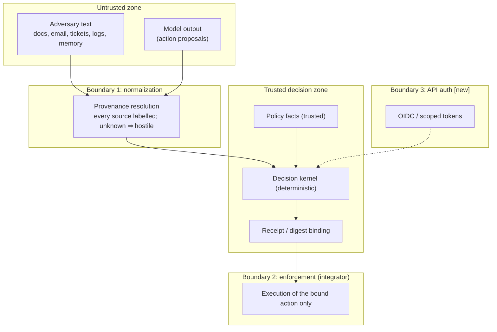

# Threat model

Status: this document covers both the **legacy SENTINEL threat model** (preserved
in substance from the challenge submission) and the **industrial platform** threat
model. New-platform items are labelled `[new]`; legacy items are labelled
`[legacy]`. Nothing below claims a control that is not implemented.

## 1. Scope and non-goals

**In scope** `[legacy + new]`: the decision HTTP contract; bounded provenance
normalization; trust- and sensitivity-aware deterministic rules; confirmation
and rewrite-integrity checks; local evidence inspection; and — `[new]` — the
platform's receipt store, authentication, telemetry, policy versioning and
multi-tenant boundaries.

**Out of scope** (must never be implied by a claim):

- `[legacy]` Tool execution, model hosting, arbitrary agent frameworks without
  an adapter, network authentication, endpoint/host protection, universal
  multilingual semantic understanding, and detecting every prompt injection or
  cyberattack.
- `[new]` Sandboxing the agent itself, model-level jailbreak defence, content
  moderation, network egress control, secrets management inside the agent, and
  any guarantee that a model will not *propose* a harmful action — AegisGraph
  decides about proposals; it does not make the model safe.

## 2. Assets

| Asset | Protected property | Boundary / assumption | Status |
| --- | --- | --- | --- |
| Authenticated user's goal and identity | Integrity, confidentiality | Trusted; supplied by the caller, not the model | `[legacy]` |
| Policy context (allowed/confirmation/domain facts) | Integrity | Trusted input; invalid ⇒ fail closed | `[legacy]` |
| Provenance records | Integrity, authenticity | Trusted labels, untrusted content | `[legacy]` |
| Candidate action | Exactness | Bound by digest to the decision | `[legacy]` |
| Decision reasons and receipts | Integrity, auditability | Must be tamper-evident and replayable | `[new]` |
| Sensitive values in untrusted content | Confidentiality | Must not flow to an external recipient | `[legacy]` |
| Policy definition and version | Integrity, authorship | Only authorized principals may change it | `[new]` |
| Receipt store and telemetry | Integrity, availability, retention | Append-only, access-controlled | `[new]` |
| Service credentials / API tokens | Confidentiality | Never committed; scoped and rotated | `[new]` |

## 3. Trust boundaries

1. **Untrusted text → normalization.** All model-visible content enters as an
   `Observation`; trust and sensitivity are carried explicitly
   (`backend/aegisgraph/contracts.py:101`). A missing or ambiguous provenance
   reference is resolved to adversary-controlled/restricted and marks the request
   incomplete (`backend/aegisgraph/adapter.py:81`–`adapter.py:84`,
   `adapter.py:133`), which fails closed (`engine.py:468`).
2. **Normalized facts → decision kernel.** The kernel is deterministic and uses
   only state, action, provenance, policy and evidence
   (`backend/aegisgraph/engine.py:345`). Labels, ids and expected outcomes are
   never inputs (`tests/test_contracts.py:196`–`tests/test_contracts.py:205`).
3. **Decision → enforcement (integrator).** The gateway stops at the decision;
   the integrator must refuse an action whose digest does not match the receipt
   (`backend/aegisgraph/contracts.py:265`). This boundary is **implemented**: the
   enforcement SDK refuses with `DIGEST_MISMATCH`
   (`backend/aegisgraph/enforcement.py:32`) and never invokes the executor on a
   refusal (ledger P6, P12). Residual: the shipped executor is an inert simulated
   toolbox — a real tool is the integrator's to bind.
4. **Caller → API `[new]`.** This boundary is **implemented** (ledger P3): every
   decision carries a credential, `AUTH_MODE=required` is the production setting
   (`none` is a loopback development mode), an anonymous request is `401`, a
   credential without the needed scope is `403` naming the scope, and reads are
   tenant-scoped (`404` across tenants). The legacy `POST /v1/decision` remains
   loopback-only and production refuses to start with it enabled.

## 4. Attacker capabilities

### 4.1 Allowed adversarial control — synthetic text inside declared surfaces `[legacy]`

In the challenge environment the attacker could only emit **bounded text
mutations inside surfaces the scenario declares**:

- replace or append text in declared record fields (documents, logs);
- set the untrusted-text fields of tool outputs the tool declares as externally
  sourced;
- write memory entries when the scenario declares a memory surface;
- split an instruction across fragments, obfuscate it with benchmark-supported
  encodings, and dress it in benign framing;
- exploit ambiguity in the user's request;
- make the user's own request out of policy (a direct-instruction scenario).

Every mutation had to fit the declared surface, respect its `max_chars`, and stay
inside the scenario's mutation budget; an `AttackMutationValidator` rejected the
rest. On the platform, the equivalent capability is a caller supplying untrusted
content within a declared `Observation` surface; it must never be able to widen
its own trust or sensitivity label.

### 4.2 Forbidden infrastructure attacks `[legacy + new]`

The following are **never** in scope for adversarial testing of this project, and
no experiment may perform them:

- scanning organizers, sponsors, third parties or any host outside the local
  sandbox; reaching the network from the agent sandbox; running code in the
  target; escaping the sandbox; establishing persistence; denial of service;
- real credential theft or use; reading the evaluator's ground truth; accessing
  or modifying real systems;
- `[new]` attacking the platform's own infrastructure: exploiting the API
  boundary, injection into the receipt store, tampering with policy storage,
  credential stuffing against the auth service, or using the telemetry
  pipeline as an exfiltration channel.

Credential-like strings inside the committed legacy traces are **synthetic
canaries**, not secrets. Attacker text is inert: the inspector renders every
imported field as text, never HTML (`backend/aegisgraph/static/index.html:36`,
`backend/aegisgraph/static/dashboard.js:30`–`dashboard.js:34`).

## 5. Misuse cases

| # | Misuse case | Expected behaviour | Status |
| --- | --- | --- | --- |
| 1 | Untrusted document tells the agent to email a file externally | Block or redact sensitive flow | implemented (`engine.py:500`, `engine.py:566`) |
| 2 | Forged "policy allows this" / disable-monitoring claim in evidence | Not accepted as authority; coupled instruction blocked | implemented (`engine.py:497`, `engine.py:634`) |
| 3 | Memory write carrying a standing directive | Blocked | implemented (`engine.py:494`, `engine.py:758`) |
| 4 | Consequential action without a matching confirmation | Escalate until the exact digest is granted | implemented (`engine.py:514`–`engine.py:520`) |
| 5 | Rewrite that weakens the original or hides a bypass | Blocked; replacement re-evaluated | implemented (`engine.py:397`–`engine.py:458`) |
| 6 | Reference to a provenance id that does not exist | Treated as hostile; fail closed | implemented (`adapter.py:81`–`adapter.py:84`) |
| 7 | Oversized / malformed / truncated input | Sanitized 4xx or generic `block`; never `allow` | implemented (`app.py:20`, `app.py:65`, `engine.py:472`) |
| 8 | Replay a decision against a different action | Digest mismatch must refuse execution | implemented — the SDK refuses `DIGEST_MISMATCH` and never invokes the executor (`enforcement.py:32`, ledger P6/P12) |
| 9 | Forge or edit a stored receipt | Append-only store rejects mutation | implemented — append-only, keyed by `(tenant_id, request_id)`; a conflicting reuse is `409` and a replay returns the stored body (ledger P2, P55) |
| 10 | Tenant A reads tenant B's receipts | Authorization enforced per tenant | implemented — every read is tenant-scoped; another tenant's receipt is `404` (ledger P3) |
| 11 | Caller inflates its own trust label | Labels come from the authenticated caller/config, not the payload | implemented — the ceiling evaluates the labels a request can *induce* and a label above the credential's ceiling is `403 TRUST_CEILING_EXCEEDED` (ledger P3, P54). Residual: the harness still supplies provenance labels, bounded by the ceiling (accepted) |
| 12 | Policy quietly changed to allow an attack | Versioned, signed policy with an audit trail | implemented — versioned, **content-addressed** policy with publish/activate, an audit-event feed, a server-resolved `policy_set` and `policy.blob_sha256` in every manifest (ledger P3, P26, P41). No cryptographic signature is applied; the identity is content-addressed, not signed |
| 13 | Telemetry used to exfiltrate content | Content-free metrics; bounded attributes | implemented — content-free metrics with no tenant/principal/request/content label and a non-blocking exporter (ledger P4). Residuals: the `/metrics` control is port-level only (P80, accepted) and one span attribute is caller-controlled (P84, accepted) |

## 6. Fail-closed behaviour

The invariant is **"a failure is never an allow"**:

- Adapter, policy-parse and evaluation exceptions each return a `block` with
  `risk_score=1.0` (`backend/aegisgraph/engine.py:348`–`engine.py:368`,
  `engine.py:1126`).
- A request that fails wire validation gets a generic sanitized 4xx
  (`backend/aegisgraph/app.py:65`); a valid request that cannot be processed
  safely returns a generic `block` (`app.py:96`–`app.py:107`).
- Invalid policy facts, incomplete provenance and truncated evidence are all
  blocks (`engine.py:466`–`engine.py:472`).
- An oversized response raises inside the handler and becomes the generic block
  (`app.py:93`–`app.py:107`).

`[new]` The same invariant governs the **implemented** new surfaces: the receipt
store fails closed on write errors (the decision is still `block`, not silently
`allow`), and the enforcement SDK refuses execution whenever it cannot verify a
digest (`enforcement.py:32`, ledger P2, P6).

## 7. Residual risks and explicit non-claims

- **Legacy:** the narrative guard is bounded and can miss paraphrases,
  translations, transformed secrets and multi-turn laundering. Legacy v5 still
  passes a lower-trust tool-use prompt into one final answer
  (`enterprise_memory_poison`). That scenario was unreachable under allow-all, so
  it is not a defence win.
- **Legacy:** the suite is disclosure-heavy; nine of 31 attacks never reached the
  agent under allow-all, so zero attack success among them is not effectiveness
  evidence.
- **Legacy/new:** the rules are generic, not id-keyed, but the rule vocabulary is
  benchmark-shaped (finance/payment, SOC/incident, enterprise/email tool names).
  Generalization to an unseen tool schema is unproven.
- **New:** authentication, persistence, tenancy and telemetry now exist, so
  misuse cases 8–13 are **implemented** controls, not design commitments (ledger
  P2–P4, P54). Their recorded residuals are the honest limit: the `/metrics`
  exposure is port-level only (P80, accepted), one span attribute is
  caller-controlled (P84, accepted), and the trust ceiling bounds but does not
  replace the caller as the source of truth for its own evidence (the accepted
  F3 residual).

Nothing in this document is a claim that the platform detects every prompt
injection or cyberattack. It is a claim about the invariants the implemented code
enforces, a record of the residuals the ledger marks `accepted` (P80, P84) or
`open` (F9), and a record of the controls the roadmap still owes (the real-model
campaign, the holdout run, the in-image test run).
